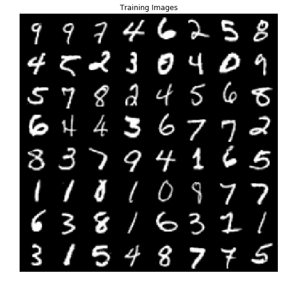
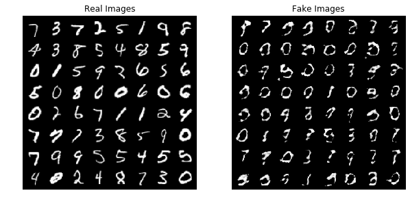

Writing your own Custom Losses
==============================

**Author** - `Avik Pal <https://avik-pal.github.io>`__ & `Aniket
Das <https://aniket1998.github.io>`__

**TorchGAN** is designed keeping a high degree of extensibility in mind,
and allows you to write custom loss functions of your own without having
to rewrite the entire training and evaluation loop. This can be done by
extending the ``torchgan.losses.GeneratorLoss`` or the
``torchgan.losses.DiscriminatorLoss`` object.

All **TorchGAN** losses have a ``train_ops`` associated with it that
dictates what steps are to be followed for the loss to be computed and
backpropagated. By default, most of the ``train_ops`` follow a **Two
Timescale Update Rule (TTUR)** as follows

1. Sample a noise vector from a Normal Distribution
   :math:`z \sim \mathcal{N}(0,\,1)`
2. :math:`d_{real} = D(x)`
3. :math:`d_{fake} = D(G(z))`
4. :math:`\mathcal{L} = Loss(d_{real}, d_{fake})` (*for a Generator Loss
   :math:`d_{real}` is generally not computed*)
5. Backpropagate over :math:`\mathcal{L}`

Where \* :math:`x` is a sample from the Data Distribution \* :math:`D`
is the Discriminator Network \* :math:`G` is the Generator Network

Simple losses that conform to this kind of an update rule can be easily
implemented by overriding the ``forward`` method of the
``GeneratorLoss`` or ``DiscriminatorLoss`` object

\*\* *NB: It is highly recommended that you go over the Introduction to
TorchGAN Tutorial before reading this* \*

Writing Custom Losses that follow the Standard Update Rule
----------------------------------------------------------

We shall demonstrate this by implementing the `Boundary Seeking GAN by
Hjelm et. al. <https://arxiv.org/abs/1702.08431>`__, also known as BGAN
BGAN involves a departure from the Minimax Loss by changing the
Generator Loss term in the following manner

.. math::  \mathcal{L_{generator}} = \frac{1}{2}E_{z \sim p(z)}[(log(D(G(z))) - log(1 - D(G(z))))^2]

where

-  :math:`z` is the noise sampled from a probability distribution
-  :math:`D` is the Discriminator Network
-  :math:`G` is the Generator Network

We can observe that the update rule for such a loss confirms with the
Standard Update Rule used in **TorchGAN**, hence this loss can be
implemented simply by extending the ``torchgan.losses.GeneratorLoss``
object and overriding the ``forward`` method

.. code:: python3

    # General Imports
    import os
    import random
    import matplotlib.pyplot as plt
    import numpy as np
    # Pytorch and Torchvision Imports
    import torch
    import torchvision
    from torch.optim import Adam
    import torch.nn as nn
    import torch.utils.data as data
    import torchvision.datasets as dsets
    import torchvision.transforms as transforms
    import torchvision.utils as vutils
    # Torchgan Imports
    import torchgan
    from torchgan.models import DCGANGenerator, DCGANDiscriminator
    from torchgan.losses import GeneratorLoss, MinimaxDiscriminatorLoss
    from torchgan.trainer import Trainer

.. code:: python3

    # Set random seed for reproducibility
    manualSeed = 999
    random.seed(manualSeed)
    torch.manual_seed(manualSeed)
    print("Random Seed: ", manualSeed)

.. parsed-literal::

    Random Seed:  999

Loading the Dataset
-------------------

We make the following transforms before feeding the **MNIST Dataset**
into the networks

1. The default size of MNIST is :math:`1 \times 28 \times 28`. However,
   by convention, the default input size in **torchgan.models** is a
   power of 2 and at least 16. Hence we shall be resizing the images to
   :math:`1 \times 32 \times 32`. One can also **zero-pad** the
   boundary, without any noticeable difference

2. The output quality of GANs is improved when the images are
   constrained in the range The images are normalized with a mean and
   standard deviation of **0.5** , thereby constraining most of the
   inputs in the range (-1, 1)

Finally the **torchgan.trainer.Trainer** needs a **DataLoader** as
input. So we are going to construct a DataLoader for the MNIST Dataset.

.. code:: python3

    dataset = dsets.MNIST(root="./mnist", train=True, download=True,
                          transform=transforms.Compose([transforms.Resize((32, 32)),
                                                        transforms.ToTensor(),
                                                        transforms.Normalize(mean=(0.5, 0.5, 0.5),
                                                                             std=(0.5, 0.5, 0.5))]))

    dataloader = torch.utils.data.DataLoader(dataset, shuffle=True, batch_size=512, num_workers=8)

Defining the Boundary Seeking Loss
----------------------------------

As discussed above, the Boundary Seeking Loss is implementing by
overriding the ``forward`` pass of the Generator Loss without requiring
any modifications to the ``train_ops``.

The ``forward`` method receives the object :math:`d_{fake} = D(G(z))` as
a parameter, where :math:`G` is the Generator Network, :math:`D` is the
Discriminator Network and :math:`z` is a sample from the Noise Prior.

*NB: This example shall be using the standard DCGAN Generator and
Discriminator available in ``torchgan.models``. By default, the last
layer of the discriminator does not apply a Sigmoid nonlinearity, the
reasson for which has already been discussed in the **Introduction to
TorchGAN** tutorial. As a result, the nonlinearity is applied within the
loss by a call to ``torch.sigmoid``. One can also alternatively omit
this and set the ``last_nonlinearity`` property of the DCGAN
Discriminator to ``torch.nn.Sigmoid`` *

.. code:: python3

    class BoundarySeekingLoss(GeneratorLoss):
        def forward(self, dx):
            dx = torch.sigmoid(dx)
            return 0.5 * torch.mean((torch.log(dx) - torch.log(1.0 - dx)) ** 2)

As per the paper, only the Generator Loss is modified. Hence we will use
one of the predefined losses, **MinimaxDiscriminatorLoss** for the
Discriminator.

.. code:: python3

    losses = [BoundarySeekingLoss(), MinimaxDiscriminatorLoss()]

Model Configuration
-------------------

We shall now be defining the neural networks for the discriminator and
generator and also set up their respective optimizers. For understanding
how to do this please refer to the previous set of tutorials.

It should be noted that we have modified the Discriminator Output to use
a **nn.Sigmoid** to conform with our Loss Function.

.. code:: python3

    network_config = {
        "generator": {"name": DCGANGenerator, "args": {"out_channels": 1, "step_channels": 8},
                      "optimizer": {"name": Adam, "args": {"lr": 0.0001, "betas": (0.5, 0.999)}}},
        "discriminator": {"name": DCGANDiscriminator, "args": {"in_channels": 1, "step_channels": 8},
                          "optimizer": {"name": Adam, "args": {"lr": 0.0001, "betas": (0.5, 0.999)}}}
    }

.. code:: python3

    if torch.cuda.is_available():
        device = torch.device("cuda:0")
        # Use deterministic cudnn algorithms
        torch.backends.cudnn.deterministic = True
        epochs = 280
    else:
        device = torch.device("cpu")
        epochs = 50

    print("Device: {}".format(device))
    print("Epochs: {}".format(epochs))

.. parsed-literal::

    Device: cuda:0
    Epochs: 280

Visualize the Training Data
---------------------------

.. code:: python3

    # Plot some of the training images
    real_batch = next(iter(dataloader))
    plt.figure(figsize=(8,8))
    plt.axis("off")
    plt.title("Training Images")
    plt.imshow(np.transpose(vutils.make_grid(real_batch[0].to(device)[:64], padding=2, normalize=True).cpu(),(1,2,0)))
    plt.show()

Training BGAN
-------------

Now we shall start the training. First we need to create the **Trainer**
object. When creating this object all the necessary neural nets and
their optimizers get instantiated.

.. code:: python3

    trainer = Trainer(network_config, losses, ncritic=5, epochs=epochs, sample_size=64, device=device)

.. code:: python3

    trainer(dataloader)

.. parsed-literal::

    Saving Model at './model/gan0.model'

.. parsed-literal::

    /data/avikpal/miniconda3/lib/python3.7/site-packages/torch/serialization.py:241: UserWarning: Couldn't retrieve source code for container of type BoundarySeekingLoss. It won't be checked for correctness upon loading.
      "type " + obj.__name__ + ". It won't be checked "

.. parsed-literal::

    Epoch 1 Summary
    generator Mean Gradients : 0.10104659697431433
    discriminator Mean Gradients : 904155.1795973617
    Mean Running Discriminator Loss : 410.93980566121763
    Mean Running Generator Loss : 0.08615240997945268
    Generating and Saving Images to ./images/epoch1_generator.png

    Saving Model at './model/gan1.model'
    Epoch 2 Summary
    generator Mean Gradients : 0.0917528209010618
    discriminator Mean Gradients : 508912.41829931387
    Mean Running Discriminator Loss : 330.299362311929
    Mean Running Generator Loss : 0.13822616737646362
    Generating and Saving Images to ./images/epoch2_generator.png

    Saving Model at './model/gan2.model'
    Epoch 3 Summary
    generator Mean Gradients : 0.13660389331132433
    discriminator Mean Gradients : 365071.02418654336
    Mean Running Discriminator Loss : 285.52138703556386
    Mean Running Generator Loss : 0.22068778881934328
    Generating and Saving Images to ./images/epoch3_generator.png

    Saving Model at './model/gan3.model'
    Epoch 4 Summary
    generator Mean Gradients : 0.23496990981277263
    discriminator Mean Gradients : 288061.7096766654
    Mean Running Discriminator Loss : 252.10384368896484
    Mean Running Generator Loss : 0.34373740385237495
    Generating and Saving Images to ./images/epoch4_generator.png

    Saving Model at './model/gan4.model'
    Epoch 5 Summary
    generator Mean Gradients : 0.39410791370078335
    discriminator Mean Gradients : 238522.85299220867
    Mean Running Discriminator Loss : 223.8407245862282
    Mean Running Generator Loss : 0.5087800807935201
    Generating and Saving Images to ./images/epoch5_generator.png

    Saving Model at './model/gan0.model'
    Epoch 6 Summary
    generator Mean Gradients : 0.682790615533757
    discriminator Mean Gradients : 203063.54383591184
    Mean Running Discriminator Loss : 199.3409036956938
    Mean Running Generator Loss : 0.7403785413472166
    Generating and Saving Images to ./images/epoch6_generator.png

    Saving Model at './model/gan1.model'
    Epoch 7 Summary
    generator Mean Gradients : 1.104931301602534
    discriminator Mean Gradients : 176370.6119636323
    Mean Running Discriminator Loss : 178.68508777549135
    Mean Running Generator Loss : 1.0162099272416658
    Generating and Saving Images to ./images/epoch7_generator.png

    Saving Model at './model/gan2.model'
    Epoch 8 Summary
    generator Mean Gradients : 1.6036781244154457
    discriminator Mean Gradients : 155644.79172851233
    Mean Running Discriminator Loss : 161.4189358439486
    Mean Running Generator Loss : 1.3083261071098229
    Generating and Saving Images to ./images/epoch8_generator.png

    Saving Model at './model/gan3.model'
    Epoch 9 Summary
    generator Mean Gradients : 2.225913970377865
    discriminator Mean Gradients : 139114.09556700184
    Mean Running Discriminator Loss : 146.8756028649497
    Mean Running Generator Loss : 1.6367742558635177
    Generating and Saving Images to ./images/epoch9_generator.png

    Saving Model at './model/gan4.model'
    Epoch 10 Summary
    generator Mean Gradients : 2.931829778236801
    discriminator Mean Gradients : 125664.68448145948
    Mean Running Discriminator Loss : 134.56923843500977
    Mean Running Generator Loss : 1.9658638968337643
    Generating and Saving Images to ./images/epoch10_generator.png

    Saving Model at './model/gan0.model'
    Epoch 11 Summary
    generator Mean Gradients : 3.8807850968817585
    discriminator Mean Gradients : 114545.54611008699
    Mean Running Discriminator Loss : 124.10831652400306
    Mean Running Generator Loss : 2.311112330696331
    Generating and Saving Images to ./images/epoch11_generator.png

    Saving Model at './model/gan1.model'
    Epoch 12 Summary
    generator Mean Gradients : 5.1698287412576205
    discriminator Mean Gradients : 105222.48624386813
    Mean Running Discriminator Loss : 115.15549915591203
    Mean Running Generator Loss : 2.648363430905615
    Generating and Saving Images to ./images/epoch12_generator.png

    Saving Model at './model/gan2.model'
    Epoch 13 Summary
    generator Mean Gradients : 6.814853712461761
    discriminator Mean Gradients : 97301.18565279867
    Mean Running Discriminator Loss : 107.41682582370927
    Mean Running Generator Loss : 2.962782170332313
    Generating and Saving Images to ./images/epoch13_generator.png

    Saving Model at './model/gan3.model'
    Epoch 14 Summary
    generator Mean Gradients : 8.976009334790081
    discriminator Mean Gradients : 90485.34276373331
    Mean Running Discriminator Loss : 100.64721602966364
    Mean Running Generator Loss : 3.2843762007387203
    Generating and Saving Images to ./images/epoch14_generator.png

    Saving Model at './model/gan4.model'
    Epoch 15 Summary
    generator Mean Gradients : 11.41268028180299
    discriminator Mean Gradients : 84558.66117166301
    Mean Running Discriminator Loss : 94.66862160068447
    Mean Running Generator Loss : 3.5905608445258634
    Generating and Saving Images to ./images/epoch15_generator.png

    Saving Model at './model/gan0.model'
    Epoch 16 Summary
    generator Mean Gradients : 14.443049977104446
    discriminator Mean Gradients : 79361.58250968378
    Mean Running Discriminator Loss : 89.3553263670686
    Mean Running Generator Loss : 3.9046881427229554
    Generating and Saving Images to ./images/epoch16_generator.png

    Saving Model at './model/gan1.model'
    Epoch 17 Summary
    generator Mean Gradients : 17.75186829010775
    discriminator Mean Gradients : 74769.80129320727
    Mean Running Discriminator Loss : 84.60016119396936
    Mean Running Generator Loss : 4.215854975835082
    Generating and Saving Images to ./images/epoch17_generator.png

    Saving Model at './model/gan2.model'
    Epoch 18 Summary
    generator Mean Gradients : 20.919981025995888
    discriminator Mean Gradients : 70680.71906246006
    Mean Running Discriminator Loss : 80.31216705311265
    Mean Running Generator Loss : 4.513470267241492
    Generating and Saving Images to ./images/epoch18_generator.png

    Saving Model at './model/gan3.model'
    Epoch 19 Summary
    generator Mean Gradients : 24.477608509622794
    discriminator Mean Gradients : 67024.01282365098
    Mean Running Discriminator Loss : 76.4328158996554
    Mean Running Generator Loss : 4.8190659702504535
    Generating and Saving Images to ./images/epoch19_generator.png

    Saving Model at './model/gan4.model'
    Epoch 20 Summary
    generator Mean Gradients : 28.30515269985177
    discriminator Mean Gradients : 63719.379151431196
    Mean Running Discriminator Loss : 72.9187915525699
    Mean Running Generator Loss : 5.10064015459364
    Generating and Saving Images to ./images/epoch20_generator.png

    Saving Model at './model/gan0.model'
    Epoch 21 Summary
    generator Mean Gradients : 33.07344904953597
    discriminator Mean Gradients : 60736.62704142764
    Mean Running Discriminator Loss : 69.73062011669296
    Mean Running Generator Loss : 5.378676313644035
    Generating and Saving Images to ./images/epoch21_generator.png

    Saving Model at './model/gan1.model'
    Epoch 22 Summary
    generator Mean Gradients : 38.8358509004833
    discriminator Mean Gradients : 58035.67698065772
    Mean Running Discriminator Loss : 66.83130579429158
    Mean Running Generator Loss : 5.640996084856586
    Generating and Saving Images to ./images/epoch22_generator.png

    Saving Model at './model/gan2.model'
    Epoch 23 Summary
    generator Mean Gradients : 44.9772951919636
    discriminator Mean Gradients : 55576.76122151912
    Mean Running Discriminator Loss : 64.17652965004864
    Mean Running Generator Loss : 5.880969424363274
    Generating and Saving Images to ./images/epoch23_generator.png

    Saving Model at './model/gan3.model'
    Epoch 24 Summary
    generator Mean Gradients : 51.87471151814951
    discriminator Mean Gradients : 53324.13793914685
    Mean Running Discriminator Loss : 61.72698161357456
    Mean Running Generator Loss : 6.126127334794512
    Generating and Saving Images to ./images/epoch24_generator.png

    Saving Model at './model/gan4.model'
    Epoch 25 Summary
    generator Mean Gradients : 58.96305034666524
    discriminator Mean Gradients : 51268.02262124796
    Mean Running Discriminator Loss : 59.45124358839908
    Mean Running Generator Loss : 6.363564404876808
    Generating and Saving Images to ./images/epoch25_generator.png

    Saving Model at './model/gan0.model'
    Epoch 26 Summary
    generator Mean Gradients : 67.9898900675182
    discriminator Mean Gradients : 49383.45203076556
    Mean Running Discriminator Loss : 57.33611727774998
    Mean Running Generator Loss : 6.612019855037623
    Generating and Saving Images to ./images/epoch26_generator.png

    Saving Model at './model/gan1.model'
    Epoch 27 Summary
    generator Mean Gradients : 79.52283193718677
    discriminator Mean Gradients : 47652.04602677464
    Mean Running Discriminator Loss : 55.37989656379293
    Mean Running Generator Loss : 6.844360271667285
    Generating and Saving Images to ./images/epoch27_generator.png

    Saving Model at './model/gan2.model'
    Epoch 28 Summary
    generator Mean Gradients : 93.75153095561824
    discriminator Mean Gradients : 46088.85493558111
    Mean Running Discriminator Loss : 53.56491221855541
    Mean Running Generator Loss : 7.056566296908977
    Generating and Saving Images to ./images/epoch28_generator.png

    Saving Model at './model/gan3.model'
    Epoch 29 Summary
    generator Mean Gradients : 113.74479390456727
    discriminator Mean Gradients : 44716.331616419295
    Mean Running Discriminator Loss : 51.87613661638622
    Mean Running Generator Loss : 7.266010832335175
    Generating and Saving Images to ./images/epoch29_generator.png

    Saving Model at './model/gan4.model'
    Epoch 30 Summary
    generator Mean Gradients : 139.38152653115367
    discriminator Mean Gradients : 43579.86331736991
    Mean Running Discriminator Loss : 50.31035135901917
    Mean Running Generator Loss : 7.4453578487638445
    Generating and Saving Images to ./images/epoch30_generator.png

    Saving Model at './model/gan0.model'
    Epoch 31 Summary
    generator Mean Gradients : 176.6785052531854
    discriminator Mean Gradients : 43511.08750491507
    Mean Running Discriminator Loss : 48.88633611795028
    Mean Running Generator Loss : 7.586267822493336
    Generating and Saving Images to ./images/epoch31_generator.png

    Saving Model at './model/gan1.model'
    Epoch 32 Summary
    generator Mean Gradients : 225.25203653489206
    discriminator Mean Gradients : 45123.384569489484
    Mean Running Discriminator Loss : 47.59593781217996
    Mean Running Generator Loss : 7.693010089953464
    Generating and Saving Images to ./images/epoch32_generator.png

    Saving Model at './model/gan2.model'
    Epoch 33 Summary
    generator Mean Gradients : 273.80291813547063
    discriminator Mean Gradients : 50327.62618132159
    Mean Running Discriminator Loss : 46.38135656086861
    Mean Running Generator Loss : 7.792859052419089
    Generating and Saving Images to ./images/epoch33_generator.png

    Saving Model at './model/gan3.model'
    Epoch 34 Summary
    generator Mean Gradients : 315.7497432698369
    discriminator Mean Gradients : 55246.629083663516
    Mean Running Discriminator Loss : 45.20613122963953
    Mean Running Generator Loss : 7.911228337354151
    Generating and Saving Images to ./images/epoch34_generator.png

    Saving Model at './model/gan4.model'
    Epoch 35 Summary
    generator Mean Gradients : 342.459572247684
    discriminator Mean Gradients : 57403.42208954517
    Mean Running Discriminator Loss : 44.06115527438771
    Mean Running Generator Loss : 8.054221118103541
    Generating and Saving Images to ./images/epoch35_generator.png

    Saving Model at './model/gan0.model'
    Epoch 36 Summary
    generator Mean Gradients : 360.5526782578031
    discriminator Mean Gradients : 58938.45903546096
    Mean Running Discriminator Loss : 42.962578967480226
    Mean Running Generator Loss : 8.208223392880138
    Generating and Saving Images to ./images/epoch36_generator.png

    Saving Model at './model/gan1.model'
    Epoch 37 Summary
    generator Mean Gradients : 372.5708137777865
    discriminator Mean Gradients : 59537.98534172513
    Mean Running Discriminator Loss : 41.91098832434271
    Mean Running Generator Loss : 8.373709627966347
    Generating and Saving Images to ./images/epoch37_generator.png

    Saving Model at './model/gan2.model'
    Epoch 38 Summary
    generator Mean Gradients : 378.3392107125452
    discriminator Mean Gradients : 59423.29949343754
    Mean Running Discriminator Loss : 40.90127750531995
    Mean Running Generator Loss : 8.545414197990628
    Generating and Saving Images to ./images/epoch38_generator.png

    Saving Model at './model/gan3.model'
    Epoch 39 Summary
    generator Mean Gradients : 382.81533449971846
    discriminator Mean Gradients : 58914.11181174742
    Mean Running Discriminator Loss : 39.930593160223516
    Mean Running Generator Loss : 8.72878426040374
    Generating and Saving Images to ./images/epoch39_generator.png

    Saving Model at './model/gan4.model'
    Epoch 40 Summary
    generator Mean Gradients : 387.2601640639906
    discriminator Mean Gradients : 58354.840756051584
    Mean Running Discriminator Loss : 38.99393405094743
    Mean Running Generator Loss : 8.92446534770099
    Generating and Saving Images to ./images/epoch40_generator.png

    Saving Model at './model/gan0.model'
    Epoch 41 Summary
    generator Mean Gradients : 393.341036759267
    discriminator Mean Gradients : 58270.99486913949
    Mean Running Discriminator Loss : 38.11509448150654
    Mean Running Generator Loss : 9.094919223973358
    Generating and Saving Images to ./images/epoch41_generator.png

    Saving Model at './model/gan1.model'
    Epoch 42 Summary
    generator Mean Gradients : 397.9524435125434
    discriminator Mean Gradients : 58947.920354461006
    Mean Running Discriminator Loss : 37.28003390773205
    Mean Running Generator Loss : 9.24809115985784
    Generating and Saving Images to ./images/epoch42_generator.png

    Saving Model at './model/gan2.model'
    Epoch 43 Summary
    generator Mean Gradients : 402.0285885681962
    discriminator Mean Gradients : 59065.62822556827
    Mean Running Discriminator Loss : 36.4728278244956
    Mean Running Generator Loss : 9.409581691338659
    Generating and Saving Images to ./images/epoch43_generator.png

    Saving Model at './model/gan3.model'
    Epoch 44 Summary
    generator Mean Gradients : 407.4780482116148
    discriminator Mean Gradients : 59042.783336512955
    Mean Running Discriminator Loss : 35.70121786196376
    Mean Running Generator Loss : 9.57821119191973
    Generating and Saving Images to ./images/epoch44_generator.png

    Saving Model at './model/gan4.model'
    Epoch 45 Summary
    generator Mean Gradients : 413.00485091093566
    discriminator Mean Gradients : 60301.31195179336
    Mean Running Discriminator Loss : 34.970282192351455
    Mean Running Generator Loss : 9.720416798700075
    Generating and Saving Images to ./images/epoch45_generator.png

    Saving Model at './model/gan0.model'
    Epoch 46 Summary
    generator Mean Gradients : 419.30023662004686
    discriminator Mean Gradients : 61836.031188711815
    Mean Running Discriminator Loss : 34.26883247353043
    Mean Running Generator Loss : 9.867888015542269
    Generating and Saving Images to ./images/epoch46_generator.png

    Saving Model at './model/gan1.model'
    Epoch 47 Summary
    generator Mean Gradients : 425.7653716652224
    discriminator Mean Gradients : 62785.84131232957
    Mean Running Discriminator Loss : 33.59382914825119
    Mean Running Generator Loss : 10.01156225681372
    Generating and Saving Images to ./images/epoch47_generator.png

    Saving Model at './model/gan2.model'
    Epoch 48 Summary
    generator Mean Gradients : 432.06557288774405
    discriminator Mean Gradients : 63298.6025499484
    Mean Running Discriminator Loss : 32.9449714387446
    Mean Running Generator Loss : 10.15464123606432
    Generating and Saving Images to ./images/epoch48_generator.png

    Saving Model at './model/gan3.model'
    Epoch 49 Summary
    generator Mean Gradients : 438.4851886111167
    discriminator Mean Gradients : 68413.17253143866
    Mean Running Discriminator Loss : 32.327410395042946
    Mean Running Generator Loss : 10.281457146428455
    Generating and Saving Images to ./images/epoch49_generator.png

    Saving Model at './model/gan4.model'
    Epoch 50 Summary
    generator Mean Gradients : 443.5232487800442
    discriminator Mean Gradients : 68860.18018615979
    Mean Running Discriminator Loss : 31.728689757449143
    Mean Running Generator Loss : 10.423061798023596
    Generating and Saving Images to ./images/epoch50_generator.png

    Saving Model at './model/gan0.model'
    Epoch 51 Summary
    generator Mean Gradients : 449.15013906311225
    discriminator Mean Gradients : 69603.31330305948
    Mean Running Discriminator Loss : 31.152661299643107
    Mean Running Generator Loss : 10.568660474339024
    Generating and Saving Images to ./images/epoch51_generator.png

    Saving Model at './model/gan1.model'
    Epoch 52 Summary
    generator Mean Gradients : 454.7154123458873
    discriminator Mean Gradients : 70692.6766429283
    Mean Running Discriminator Loss : 30.597309920863967
    Mean Running Generator Loss : 10.7007371342926
    Generating and Saving Images to ./images/epoch52_generator.png

    Saving Model at './model/gan2.model'
    Epoch 53 Summary
    generator Mean Gradients : 458.49301009895305
    discriminator Mean Gradients : 71137.17837097037
    Mean Running Discriminator Loss : 30.054993625933992
    Mean Running Generator Loss : 10.85426742800003
    Generating and Saving Images to ./images/epoch53_generator.png

    Saving Model at './model/gan3.model'
    Epoch 54 Summary
    generator Mean Gradients : 462.6127675797955
    discriminator Mean Gradients : 71103.90218875057
    Mean Running Discriminator Loss : 29.526739727965296
    Mean Running Generator Loss : 11.034252051223142
    Generating and Saving Images to ./images/epoch54_generator.png

    Saving Model at './model/gan4.model'
    Epoch 55 Summary
    generator Mean Gradients : 466.5354650078687
    discriminator Mean Gradients : 71437.89029890379
    Mean Running Discriminator Loss : 29.017814467450137
    Mean Running Generator Loss : 11.193629556922428
    Generating and Saving Images to ./images/epoch55_generator.png

    Saving Model at './model/gan0.model'
    Epoch 56 Summary
    generator Mean Gradients : 471.3631727477986
    discriminator Mean Gradients : 72157.28759082977
    Mean Running Discriminator Loss : 28.530794053706035
    Mean Running Generator Loss : 11.338770133140251
    Generating and Saving Images to ./images/epoch56_generator.png

    Saving Model at './model/gan1.model'
    Epoch 57 Summary
    generator Mean Gradients : 475.92789962021277
    discriminator Mean Gradients : 73896.34572222302
    Mean Running Discriminator Loss : 28.062797135317606
    Mean Running Generator Loss : 11.470385857217048
    Generating and Saving Images to ./images/epoch57_generator.png

    Saving Model at './model/gan2.model'
    Epoch 58 Summary
    generator Mean Gradients : 479.2582678296566
    discriminator Mean Gradients : 76792.58929389513
    Mean Running Discriminator Loss : 27.60925459178096
    Mean Running Generator Loss : 11.62239845138699
    Generating and Saving Images to ./images/epoch58_generator.png

    Saving Model at './model/gan3.model'
    Epoch 59 Summary
    generator Mean Gradients : 482.43665878072665
    discriminator Mean Gradients : 76958.9183076429
    Mean Running Discriminator Loss : 27.166442899902947
    Mean Running Generator Loss : 11.777624481835664
    Generating and Saving Images to ./images/epoch59_generator.png

    Saving Model at './model/gan4.model'
    Epoch 60 Summary
    generator Mean Gradients : 484.92837482292305
    discriminator Mean Gradients : 77797.81038752275
    Mean Running Discriminator Loss : 26.73906112197092
    Mean Running Generator Loss : 11.916582588119548
    Generating and Saving Images to ./images/epoch60_generator.png

    Saving Model at './model/gan0.model'
    Epoch 61 Summary
    generator Mean Gradients : 488.7737460783593
    discriminator Mean Gradients : 78550.27528344053
    Mean Running Discriminator Loss : 26.327519465785418
    Mean Running Generator Loss : 12.057209059629693
    Generating and Saving Images to ./images/epoch61_generator.png

    Saving Model at './model/gan1.model'
    Epoch 62 Summary
    generator Mean Gradients : 492.89488037804085
    discriminator Mean Gradients : 81651.790245848
    Mean Running Discriminator Loss : 25.93509116469429
    Mean Running Generator Loss : 12.175267930598064
    Generating and Saving Images to ./images/epoch62_generator.png

    Saving Model at './model/gan2.model'
    Epoch 63 Summary
    generator Mean Gradients : 496.3478996440444
    discriminator Mean Gradients : 85078.3737468274
    Mean Running Discriminator Loss : 25.55491863719704
    Mean Running Generator Loss : 12.295112691666848
    Generating and Saving Images to ./images/epoch63_generator.png

    Saving Model at './model/gan3.model'
    Epoch 64 Summary
    generator Mean Gradients : 499.1140988787908
    discriminator Mean Gradients : 87418.43872322649
    Mean Running Discriminator Loss : 25.185410052232083
    Mean Running Generator Loss : 12.414744855898903
    Generating and Saving Images to ./images/epoch64_generator.png

    Saving Model at './model/gan4.model'
    Epoch 65 Summary
    generator Mean Gradients : 501.0285846563768
    discriminator Mean Gradients : 90452.78240646089
    Mean Running Discriminator Loss : 24.82530696266361
    Mean Running Generator Loss : 12.544742515563208
    Generating and Saving Images to ./images/epoch65_generator.png

    Saving Model at './model/gan0.model'
    Epoch 66 Summary
    generator Mean Gradients : 503.79613927716923
    discriminator Mean Gradients : 92663.32911794938
    Mean Running Discriminator Loss : 24.477837258003724
    Mean Running Generator Loss : 12.659137275038868
    Generating and Saving Images to ./images/epoch66_generator.png

    Saving Model at './model/gan1.model'
    Epoch 67 Summary
    generator Mean Gradients : 507.4395610685864
    discriminator Mean Gradients : 99616.53822025351
    Mean Running Discriminator Loss : 24.148221401895885
    Mean Running Generator Loss : 12.763938274185083
    Generating and Saving Images to ./images/epoch67_generator.png

    Saving Model at './model/gan2.model'
    Epoch 68 Summary
    generator Mean Gradients : 509.65219373991613
    discriminator Mean Gradients : 104433.68980405873
    Mean Running Discriminator Loss : 23.827234581229856
    Mean Running Generator Loss : 12.842774634525133
    Generating and Saving Images to ./images/epoch68_generator.png

    Saving Model at './model/gan3.model'
    Epoch 69 Summary
    generator Mean Gradients : 512.081008016372
    discriminator Mean Gradients : 106645.85433041162
    Mean Running Discriminator Loss : 23.507725643464855
    Mean Running Generator Loss : 12.956259078552582
    Generating and Saving Images to ./images/epoch69_generator.png

    Saving Model at './model/gan4.model'
    Epoch 70 Summary
    generator Mean Gradients : 513.486725647053
    discriminator Mean Gradients : 108224.19860797546
    Mean Running Discriminator Loss : 23.19366360911265
    Mean Running Generator Loss : 13.073415282015524
    Generating and Saving Images to ./images/epoch70_generator.png

    Saving Model at './model/gan0.model'
    Epoch 71 Summary
    generator Mean Gradients : 515.159637508547
    discriminator Mean Gradients : 109417.01931021761
    Mean Running Discriminator Loss : 22.885470423999507
    Mean Running Generator Loss : 13.212987213857863
    Generating and Saving Images to ./images/epoch71_generator.png

    Saving Model at './model/gan1.model'
    Epoch 72 Summary
    generator Mean Gradients : 516.9334121258128
    discriminator Mean Gradients : 111354.6861839031
    Mean Running Discriminator Loss : 22.586056594305415
    Mean Running Generator Loss : 13.354865271933377
    Generating and Saving Images to ./images/epoch72_generator.png

    Saving Model at './model/gan2.model'
    Epoch 73 Summary
    generator Mean Gradients : 519.3139076157329
    discriminator Mean Gradients : 114819.86163374897
    Mean Running Discriminator Loss : 22.297255884197767
    Mean Running Generator Loss : 13.47746120689267
    Generating and Saving Images to ./images/epoch73_generator.png

    Saving Model at './model/gan3.model'
    Epoch 74 Summary
    generator Mean Gradients : 521.9320172177355
    discriminator Mean Gradients : 116696.08074201703
    Mean Running Discriminator Loss : 22.01522438626769
    Mean Running Generator Loss : 13.602001788784468
    Generating and Saving Images to ./images/epoch74_generator.png

    Saving Model at './model/gan4.model'
    Epoch 75 Summary
    generator Mean Gradients : 524.1056253904784
    discriminator Mean Gradients : 118352.60868734807
    Mean Running Discriminator Loss : 21.73984903404268
    Mean Running Generator Loss : 13.730969753669902
    Generating and Saving Images to ./images/epoch75_generator.png

    Saving Model at './model/gan0.model'
    Epoch 76 Summary
    generator Mean Gradients : 527.0543119981251
    discriminator Mean Gradients : 119243.47307817447
    Mean Running Discriminator Loss : 21.47090656093316
    Mean Running Generator Loss : 13.858026690866254
    Generating and Saving Images to ./images/epoch76_generator.png

    Saving Model at './model/gan1.model'
    Epoch 77 Summary
    generator Mean Gradients : 530.8089041348584
    discriminator Mean Gradients : 123091.16710818227
    Mean Running Discriminator Loss : 21.214088362536057
    Mean Running Generator Loss : 13.957706183123396
    Generating and Saving Images to ./images/epoch77_generator.png

    Saving Model at './model/gan2.model'
    Epoch 78 Summary
    generator Mean Gradients : 537.5786696950167
    discriminator Mean Gradients : 129620.19519790277
    Mean Running Discriminator Loss : 20.972079391925167
    Mean Running Generator Loss : 14.041362181518354
    Generating and Saving Images to ./images/epoch78_generator.png

    Saving Model at './model/gan3.model'
    Epoch 79 Summary
    generator Mean Gradients : 544.8396088725561
    discriminator Mean Gradients : 136813.06365870155
    Mean Running Discriminator Loss : 20.73705689728618
    Mean Running Generator Loss : 14.107288217187008
    Generating and Saving Images to ./images/epoch79_generator.png

    Saving Model at './model/gan4.model'
    Epoch 80 Summary
    generator Mean Gradients : 550.2004009620167
    discriminator Mean Gradients : 140781.00664127426
    Mean Running Discriminator Loss : 20.50098621388108
    Mean Running Generator Loss : 14.19873739326949
    Generating and Saving Images to ./images/epoch80_generator.png

    Saving Model at './model/gan0.model'
    Epoch 81 Summary
    generator Mean Gradients : 555.0438923836866
    discriminator Mean Gradients : 141609.61326295638
    Mean Running Discriminator Loss : 20.266305355348518
    Mean Running Generator Loss : 14.314550008011054
    Generating and Saving Images to ./images/epoch81_generator.png

    Saving Model at './model/gan1.model'
    Epoch 82 Summary
    generator Mean Gradients : 558.8800614388977
    discriminator Mean Gradients : 142312.01893461755
    Mean Running Discriminator Loss : 20.036424936026755
    Mean Running Generator Loss : 14.432714610331699
    Generating and Saving Images to ./images/epoch82_generator.png

    Saving Model at './model/gan2.model'
    Epoch 83 Summary
    generator Mean Gradients : 561.6565121548001
    discriminator Mean Gradients : 142655.23848665372
    Mean Running Discriminator Loss : 19.8112357839659
    Mean Running Generator Loss : 14.549268166857404
    Generating and Saving Images to ./images/epoch83_generator.png

    Saving Model at './model/gan3.model'
    Epoch 84 Summary
    generator Mean Gradients : 565.2535065751665
    discriminator Mean Gradients : 142753.43074390697
    Mean Running Discriminator Loss : 19.592499260592955
    Mean Running Generator Loss : 14.65798742558377
    Generating and Saving Images to ./images/epoch84_generator.png

    Saving Model at './model/gan4.model'
    Epoch 85 Summary
    generator Mean Gradients : 569.7522644934376
    discriminator Mean Gradients : 144013.31983906566
    Mean Running Discriminator Loss : 19.382955107443472
    Mean Running Generator Loss : 14.740197141078168
    Generating and Saving Images to ./images/epoch85_generator.png

    Saving Model at './model/gan0.model'
    Epoch 86 Summary
    generator Mean Gradients : 578.1730073223813
    discriminator Mean Gradients : 153988.65895851454
    Mean Running Discriminator Loss : 19.188339583619776
    Mean Running Generator Loss : 14.809831021948181
    Generating and Saving Images to ./images/epoch86_generator.png

    Saving Model at './model/gan1.model'
    Epoch 87 Summary
    generator Mean Gradients : 586.730508830336
    discriminator Mean Gradients : 159521.51817038434
    Mean Running Discriminator Loss : 18.99684267762679
    Mean Running Generator Loss : 14.86360389722045
    Generating and Saving Images to ./images/epoch87_generator.png

    Saving Model at './model/gan2.model'
    Epoch 88 Summary
    generator Mean Gradients : 593.5706831012892
    discriminator Mean Gradients : 179148.02296230136
    Mean Running Discriminator Loss : 18.809037475288488
    Mean Running Generator Loss : 14.935190354877
    Generating and Saving Images to ./images/epoch88_generator.png

    Saving Model at './model/gan3.model'
    Epoch 89 Summary
    generator Mean Gradients : 597.957100734982
    discriminator Mean Gradients : 181318.78582988746
    Mean Running Discriminator Loss : 18.617637812583315
    Mean Running Generator Loss : 15.008685604292813
    Generating and Saving Images to ./images/epoch89_generator.png

    Saving Model at './model/gan4.model'
    Epoch 90 Summary
    generator Mean Gradients : 600.960783562583
    discriminator Mean Gradients : 181987.74651060367
    Mean Running Discriminator Loss : 18.426069200207284
    Mean Running Generator Loss : 15.104381450623793
    Generating and Saving Images to ./images/epoch90_generator.png

    Saving Model at './model/gan0.model'
    Epoch 91 Summary
    generator Mean Gradients : 603.8177266348187
    discriminator Mean Gradients : 182223.5287744183
    Mean Running Discriminator Loss : 18.236230895668406
    Mean Running Generator Loss : 15.211292110364433
    Generating and Saving Images to ./images/epoch91_generator.png

    Saving Model at './model/gan1.model'
    Epoch 92 Summary
    generator Mean Gradients : 608.3518731267212
    discriminator Mean Gradients : 184893.76661488527
    Mean Running Discriminator Loss : 18.05333776134166
    Mean Running Generator Loss : 15.301159236773945
    Generating and Saving Images to ./images/epoch92_generator.png

    Saving Model at './model/gan2.model'
    Epoch 93 Summary
    generator Mean Gradients : 616.0489080701486
    discriminator Mean Gradients : 191310.13942300377
    Mean Running Discriminator Loss : 17.882998310659556
    Mean Running Generator Loss : 15.357619980549554
    Generating and Saving Images to ./images/epoch93_generator.png

    Saving Model at './model/gan3.model'
    Epoch 94 Summary
    generator Mean Gradients : 625.240201185272
    discriminator Mean Gradients : 224667.17150692886
    Mean Running Discriminator Loss : 17.726907846526927
    Mean Running Generator Loss : 15.400987116933043
    Generating and Saving Images to ./images/epoch94_generator.png

    Saving Model at './model/gan4.model'
    Epoch 95 Summary
    generator Mean Gradients : 631.8468198506062
    discriminator Mean Gradients : 230929.53006124476
    Mean Running Discriminator Loss : 17.56559125874906
    Mean Running Generator Loss : 15.457371022444248
    Generating and Saving Images to ./images/epoch95_generator.png

    Saving Model at './model/gan0.model'
    Epoch 96 Summary
    generator Mean Gradients : 637.0818308403447
    discriminator Mean Gradients : 238826.47065816622
    Mean Running Discriminator Loss : 17.406489321001736
    Mean Running Generator Loss : 15.523070389911243
    Generating and Saving Images to ./images/epoch96_generator.png

    Saving Model at './model/gan1.model'
    Epoch 97 Summary
    generator Mean Gradients : 641.0207414684694
    discriminator Mean Gradients : 243841.46453369805
    Mean Running Discriminator Loss : 17.25261991237367
    Mean Running Generator Loss : 15.564229258720857
    Generating and Saving Images to ./images/epoch97_generator.png

    Saving Model at './model/gan2.model'
    Epoch 98 Summary
    generator Mean Gradients : 642.9745815599034
    discriminator Mean Gradients : 257016.56875074227
    Mean Running Discriminator Loss : 17.103353004045694
    Mean Running Generator Loss : 15.607941730394863
    Generating and Saving Images to ./images/epoch98_generator.png

    Saving Model at './model/gan3.model'
    Epoch 99 Summary
    generator Mean Gradients : 644.5218754030562
    discriminator Mean Gradients : 271251.22868646844
    Mean Running Discriminator Loss : 16.95461582014249
    Mean Running Generator Loss : 15.644793885683894
    Generating and Saving Images to ./images/epoch99_generator.png

    Saving Model at './model/gan4.model'
    Epoch 100 Summary
    generator Mean Gradients : 645.6327686126514
    discriminator Mean Gradients : 276482.49005786324
    Mean Running Discriminator Loss : 16.80667438454926
    Mean Running Generator Loss : 15.695995154845829
    Generating and Saving Images to ./images/epoch100_generator.png

    Saving Model at './model/gan0.model'
    Epoch 101 Summary
    generator Mean Gradients : 646.3393544762628
    discriminator Mean Gradients : 282537.28967709374
    Mean Running Discriminator Loss : 16.661067763821382
    Mean Running Generator Loss : 15.742960430852031
    Generating and Saving Images to ./images/epoch101_generator.png

    Saving Model at './model/gan1.model'
    Epoch 102 Summary
    generator Mean Gradients : 647.5672895267414
    discriminator Mean Gradients : 288507.86037928285
    Mean Running Discriminator Loss : 16.518600676602436
    Mean Running Generator Loss : 15.800655034115458
    Generating and Saving Images to ./images/epoch102_generator.png

    Saving Model at './model/gan2.model'
    Epoch 103 Summary
    generator Mean Gradients : 647.7412709141742
    discriminator Mean Gradients : 314302.85685380583
    Mean Running Discriminator Loss : 16.383672440322496
    Mean Running Generator Loss : 15.846377298421315
    Generating and Saving Images to ./images/epoch103_generator.png

    Saving Model at './model/gan3.model'
    Epoch 104 Summary
    generator Mean Gradients : 648.4524626444357
    discriminator Mean Gradients : 320435.00723684084
    Mean Running Discriminator Loss : 16.247030216903028
    Mean Running Generator Loss : 15.90076132716114
    Generating and Saving Images to ./images/epoch104_generator.png

    Saving Model at './model/gan4.model'
    Epoch 105 Summary
    generator Mean Gradients : 648.993882209101
    discriminator Mean Gradients : 439696.606646067
    Mean Running Discriminator Loss : 16.126849925127168
    Mean Running Generator Loss : 15.963128032773144
    Generating and Saving Images to ./images/epoch105_generator.png

    Saving Model at './model/gan0.model'
    Epoch 106 Summary
    generator Mean Gradients : 649.2709497750791
    discriminator Mean Gradients : 440775.21888790594
    Mean Running Discriminator Loss : 15.992248382883966
    Mean Running Generator Loss : 16.014348202205593
    Generating and Saving Images to ./images/epoch106_generator.png

    Saving Model at './model/gan1.model'
    Epoch 107 Summary
    generator Mean Gradients : 649.2257747752425
    discriminator Mean Gradients : 442289.8305929409
    Mean Running Discriminator Loss : 15.862200414835367
    Mean Running Generator Loss : 16.05319449210706
    Generating and Saving Images to ./images/epoch107_generator.png

    Saving Model at './model/gan2.model'
    Epoch 108 Summary
    generator Mean Gradients : 648.9680789922536
    discriminator Mean Gradients : 446312.7395942404
    Mean Running Discriminator Loss : 15.736579113551612
    Mean Running Generator Loss : 16.08456796589653
    Generating and Saving Images to ./images/epoch108_generator.png

    Saving Model at './model/gan3.model'
    Epoch 109 Summary
    generator Mean Gradients : 648.7038793195891
    discriminator Mean Gradients : 457454.3402149798
    Mean Running Discriminator Loss : 15.616771678707172
    Mean Running Generator Loss : 16.111117924339535
    Generating and Saving Images to ./images/epoch109_generator.png

    Saving Model at './model/gan4.model'
    Epoch 110 Summary
    generator Mean Gradients : 648.4008167645502
    discriminator Mean Gradients : 466637.9603338969
    Mean Running Discriminator Loss : 15.498221444905676
    Mean Running Generator Loss : 16.131228003020933
    Generating and Saving Images to ./images/epoch110_generator.png

    Saving Model at './model/gan0.model'
    Epoch 111 Summary
    generator Mean Gradients : 648.6782522601437
    discriminator Mean Gradients : 656279.1247357191
    Mean Running Discriminator Loss : 15.397752812322514
    Mean Running Generator Loss : 16.16208476676314
    Generating and Saving Images to ./images/epoch111_generator.png

    Saving Model at './model/gan1.model'
    Epoch 112 Summary
    generator Mean Gradients : 648.7247556719111
    discriminator Mean Gradients : 663556.2233953528
    Mean Running Discriminator Loss : 15.284825403402282
    Mean Running Generator Loss : 16.18692423736482
    Generating and Saving Images to ./images/epoch112_generator.png

    Saving Model at './model/gan2.model'
    Epoch 113 Summary
    generator Mean Gradients : 648.1427699947336
    discriminator Mean Gradients : 666390.8533131883
    Mean Running Discriminator Loss : 15.173861077534477
    Mean Running Generator Loss : 16.199181990646995
    Generating and Saving Images to ./images/epoch113_generator.png

    Saving Model at './model/gan3.model'
    Epoch 114 Summary
    generator Mean Gradients : 647.8346053588465
    discriminator Mean Gradients : 671838.9177523591
    Mean Running Discriminator Loss : 15.068734286442163
    Mean Running Generator Loss : 16.21086638111141
    Generating and Saving Images to ./images/epoch114_generator.png

    Saving Model at './model/gan4.model'
    Epoch 115 Summary
    generator Mean Gradients : 646.8544339961518
    discriminator Mean Gradients : 689211.2463001327
    Mean Running Discriminator Loss : 14.967866622078436
    Mean Running Generator Loss : 16.209961407502885
    Generating and Saving Images to ./images/epoch115_generator.png

    Saving Model at './model/gan0.model'
    Epoch 116 Summary
    generator Mean Gradients : 646.3106700713007
    discriminator Mean Gradients : 699529.4224030271
    Mean Running Discriminator Loss : 14.866800232708218
    Mean Running Generator Loss : 16.209461535582246
    Generating and Saving Images to ./images/epoch116_generator.png

    Saving Model at './model/gan1.model'
    Epoch 117 Summary
    generator Mean Gradients : 646.156102661154
    discriminator Mean Gradients : 712815.0973883604
    Mean Running Discriminator Loss : 14.767586242634758
    Mean Running Generator Loss : 16.221995374605946
    Generating and Saving Images to ./images/epoch117_generator.png

    Saving Model at './model/gan2.model'
    Epoch 118 Summary
    generator Mean Gradients : 645.7030683222197
    discriminator Mean Gradients : 725644.2187848788
    Mean Running Discriminator Loss : 14.67078381262375
    Mean Running Generator Loss : 16.23169095487981
    Generating and Saving Images to ./images/epoch118_generator.png

    Saving Model at './model/gan3.model'
    Epoch 119 Summary
    generator Mean Gradients : 645.4339345176935
    discriminator Mean Gradients : 735763.8896533303
    Mean Running Discriminator Loss : 14.574635835754712
    Mean Running Generator Loss : 16.241221801222338
    Generating and Saving Images to ./images/epoch119_generator.png

    Saving Model at './model/gan4.model'
    Epoch 120 Summary
    generator Mean Gradients : 645.2160145140601
    discriminator Mean Gradients : 742361.567578448
    Mean Running Discriminator Loss : 14.47956401456863
    Mean Running Generator Loss : 16.249136233919348
    Generating and Saving Images to ./images/epoch120_generator.png

    Saving Model at './model/gan0.model'
    Epoch 121 Summary
    generator Mean Gradients : 645.4081106918873
    discriminator Mean Gradients : 757048.835339149
    Mean Running Discriminator Loss : 14.388832063345928
    Mean Running Generator Loss : 16.266576953812734
    Generating and Saving Images to ./images/epoch121_generator.png

    Saving Model at './model/gan1.model'
    Epoch 122 Summary
    generator Mean Gradients : 645.3005100188307
    discriminator Mean Gradients : 778619.4688505615
    Mean Running Discriminator Loss : 14.300927573754436
    Mean Running Generator Loss : 16.27442402460535
    Generating and Saving Images to ./images/epoch122_generator.png

    Saving Model at './model/gan2.model'
    Epoch 123 Summary
    generator Mean Gradients : 645.0907921830616
    discriminator Mean Gradients : 795989.421637253
    Mean Running Discriminator Loss : 14.213652192900517
    Mean Running Generator Loss : 16.288045493414277
    Generating and Saving Images to ./images/epoch123_generator.png

    Saving Model at './model/gan3.model'
    Epoch 124 Summary
    generator Mean Gradients : 646.2238311032332
    discriminator Mean Gradients : 17217518.43578663
    Mean Running Discriminator Loss : 14.838358763565639
    Mean Running Generator Loss : 16.330983234111883
    Generating and Saving Images to ./images/epoch124_generator.png

    Saving Model at './model/gan4.model'
    Epoch 125 Summary
    generator Mean Gradients : 644.4608769065012
    discriminator Mean Gradients : 17083558.016034473
    Mean Running Discriminator Loss : 14.759644617083719
    Mean Running Generator Loss : 16.323601020409143
    Generating and Saving Images to ./images/epoch125_generator.png

    Saving Model at './model/gan0.model'
    Epoch 126 Summary
    generator Mean Gradients : 643.0813193113287
    discriminator Mean Gradients : 16954780.9110485
    Mean Running Discriminator Loss : 14.687242595925387
    Mean Running Generator Loss : 16.307922237755
    Generating and Saving Images to ./images/epoch126_generator.png

    Saving Model at './model/gan1.model'
    Epoch 127 Summary
    generator Mean Gradients : 641.715702390796
    discriminator Mean Gradients : 16831654.297284942
    Mean Running Discriminator Loss : 14.627045991402092
    Mean Running Generator Loss : 16.284610732242943
    Generating and Saving Images to ./images/epoch127_generator.png

    Saving Model at './model/gan2.model'
    Epoch 128 Summary
    generator Mean Gradients : 640.411438537061
    discriminator Mean Gradients : 16716449.316028506
    Mean Running Discriminator Loss : 14.582698929355425
    Mean Running Generator Loss : 16.255401051482718
    Generating and Saving Images to ./images/epoch128_generator.png

    Saving Model at './model/gan3.model'
    Epoch 129 Summary
    generator Mean Gradients : 639.3987594843701
    discriminator Mean Gradients : 16608608.154035825
    Mean Running Discriminator Loss : 14.548080824560278
    Mean Running Generator Loss : 16.223972118406117
    Generating and Saving Images to ./images/epoch129_generator.png

    Saving Model at './model/gan4.model'
    Epoch 130 Summary
    generator Mean Gradients : 638.1175616527122
    discriminator Mean Gradients : 16502687.629240245
    Mean Running Discriminator Loss : 14.510982594444785
    Mean Running Generator Loss : 16.195130983434346
    Generating and Saving Images to ./images/epoch130_generator.png

    Saving Model at './model/gan0.model'
    Epoch 131 Summary
    generator Mean Gradients : 637.3108999567447
    discriminator Mean Gradients : 16397065.99821223
    Mean Running Discriminator Loss : 14.467682178904985
    Mean Running Generator Loss : 16.171300207211708
    Generating and Saving Images to ./images/epoch131_generator.png

    Saving Model at './model/gan1.model'
    Epoch 132 Summary
    generator Mean Gradients : 636.5745774766855
    discriminator Mean Gradients : 16295467.249567047
    Mean Running Discriminator Loss : 14.421374813566949
    Mean Running Generator Loss : 16.15129780571965
    Generating and Saving Images to ./images/epoch132_generator.png

    Saving Model at './model/gan2.model'
    Epoch 133 Summary
    generator Mean Gradients : 635.7229127025562
    discriminator Mean Gradients : 16199089.652610963
    Mean Running Discriminator Loss : 14.376638415454108
    Mean Running Generator Loss : 16.13604015210307
    Generating and Saving Images to ./images/epoch133_generator.png

    Saving Model at './model/gan3.model'
    Epoch 134 Summary
    generator Mean Gradients : 635.2526668122543
    discriminator Mean Gradients : 16103822.794542227
    Mean Running Discriminator Loss : 14.331760627415258
    Mean Running Generator Loss : 16.11796907591685
    Generating and Saving Images to ./images/epoch134_generator.png

    Saving Model at './model/gan4.model'
    Epoch 135 Summary
    generator Mean Gradients : 634.4586929034205
    discriminator Mean Gradients : 16033792.783611326
    Mean Running Discriminator Loss : 14.297601486922096
    Mean Running Generator Loss : 16.093127976418973
    Generating and Saving Images to ./images/epoch135_generator.png

    Saving Model at './model/gan0.model'
    Epoch 136 Summary
    generator Mean Gradients : 633.8707013164387
    discriminator Mean Gradients : 15949937.198861258
    Mean Running Discriminator Loss : 14.26698853564379
    Mean Running Generator Loss : 16.066607375620542
    Generating and Saving Images to ./images/epoch136_generator.png

    Saving Model at './model/gan1.model'
    Epoch 137 Summary
    generator Mean Gradients : 633.165144178994
    discriminator Mean Gradients : 15903131.024833394
    Mean Running Discriminator Loss : 14.240068747578473
    Mean Running Generator Loss : 16.04015774645796
    Generating and Saving Images to ./images/epoch137_generator.png

    Saving Model at './model/gan2.model'
    Epoch 138 Summary
    generator Mean Gradients : 632.3235431195877
    discriminator Mean Gradients : 15838808.823522868
    Mean Running Discriminator Loss : 14.204819373935608
    Mean Running Generator Loss : 16.02090672552151
    Generating and Saving Images to ./images/epoch138_generator.png

    Saving Model at './model/gan3.model'
    Epoch 139 Summary
    generator Mean Gradients : 631.6583734799098
    discriminator Mean Gradients : 15765118.943717271
    Mean Running Discriminator Loss : 14.166899792143207
    Mean Running Generator Loss : 16.00076488184174
    Generating and Saving Images to ./images/epoch139_generator.png

    Saving Model at './model/gan4.model'
    Epoch 140 Summary
    generator Mean Gradients : 630.731896160661
    discriminator Mean Gradients : 15686510.911684316
    Mean Running Discriminator Loss : 14.129584930174179
    Mean Running Generator Loss : 15.981795604682368
    Generating and Saving Images to ./images/epoch140_generator.png

    Saving Model at './model/gan0.model'
    Epoch 141 Summary
    generator Mean Gradients : 630.0433896186626
    discriminator Mean Gradients : 15633840.042816132
    Mean Running Discriminator Loss : 14.093919289354444
    Mean Running Generator Loss : 15.961998973199606
    Generating and Saving Images to ./images/epoch141_generator.png

    Saving Model at './model/gan1.model'
    Epoch 142 Summary
    generator Mean Gradients : 629.2026533201222
    discriminator Mean Gradients : 15606085.996576613
    Mean Running Discriminator Loss : 14.061598668846496
    Mean Running Generator Loss : 15.9428361604637
    Generating and Saving Images to ./images/epoch142_generator.png

    Saving Model at './model/gan2.model'
    Epoch 143 Summary
    generator Mean Gradients : 628.087349806934
    discriminator Mean Gradients : 15546369.490931628
    Mean Running Discriminator Loss : 14.02515991799612
    Mean Running Generator Loss : 15.923498266305085
    Generating and Saving Images to ./images/epoch143_generator.png

    Saving Model at './model/gan3.model'
    Epoch 144 Summary
    generator Mean Gradients : 627.0069898796429
    discriminator Mean Gradients : 15493240.040030813
    Mean Running Discriminator Loss : 13.990840374487725
    Mean Running Generator Loss : 15.904482040604702
    Generating and Saving Images to ./images/epoch144_generator.png

    Saving Model at './model/gan4.model'
    Epoch 145 Summary
    generator Mean Gradients : 625.8841707219842
    discriminator Mean Gradients : 15416497.709113875
    Mean Running Discriminator Loss : 13.952698899030441
    Mean Running Generator Loss : 15.884546967586889
    Generating and Saving Images to ./images/epoch145_generator.png

    Saving Model at './model/gan0.model'
    Epoch 146 Summary
    generator Mean Gradients : 624.9183827328686
    discriminator Mean Gradients : 15349086.666661398
    Mean Running Discriminator Loss : 13.916209451199471
    Mean Running Generator Loss : 15.86784494761756
    Generating and Saving Images to ./images/epoch146_generator.png

    Saving Model at './model/gan1.model'
    Epoch 147 Summary
    generator Mean Gradients : 623.9094287866702
    discriminator Mean Gradients : 15288590.427232914
    Mean Running Discriminator Loss : 13.878669126247274
    Mean Running Generator Loss : 15.851655074993754
    Generating and Saving Images to ./images/epoch147_generator.png

    Saving Model at './model/gan2.model'
    Epoch 148 Summary
    generator Mean Gradients : 622.5842039366257
    discriminator Mean Gradients : 15213025.470839746
    Mean Running Discriminator Loss : 13.838481041154408
    Mean Running Generator Loss : 15.834866327315467
    Generating and Saving Images to ./images/epoch148_generator.png

    Saving Model at './model/gan3.model'
    Epoch 149 Summary
    generator Mean Gradients : 621.64443401896
    discriminator Mean Gradients : 15145391.14041594
    Mean Running Discriminator Loss : 13.798344485444762
    Mean Running Generator Loss : 15.821017874768632
    Generating and Saving Images to ./images/epoch149_generator.png

    Saving Model at './model/gan4.model'
    Epoch 150 Summary
    generator Mean Gradients : 620.4923867868213
    discriminator Mean Gradients : 15075792.190902295
    Mean Running Discriminator Loss : 13.756495155450482
    Mean Running Generator Loss : 15.809692595786505
    Generating and Saving Images to ./images/epoch150_generator.png

    Saving Model at './model/gan0.model'
    Epoch 151 Summary
    generator Mean Gradients : 619.5636431543744
    discriminator Mean Gradients : 15014977.025679072
    Mean Running Discriminator Loss : 13.715135155894838
    Mean Running Generator Loss : 15.799664590374999
    Generating and Saving Images to ./images/epoch151_generator.png

    Saving Model at './model/gan1.model'
    Epoch 152 Summary
    generator Mean Gradients : 618.5696092913402
    discriminator Mean Gradients : 14945511.094412642
    Mean Running Discriminator Loss : 13.673251411629995
    Mean Running Generator Loss : 15.789595233570315
    Generating and Saving Images to ./images/epoch152_generator.png

    Saving Model at './model/gan2.model'
    Epoch 153 Summary
    generator Mean Gradients : 617.4978116990885
    discriminator Mean Gradients : 14866084.59649106
    Mean Running Discriminator Loss : 13.628353106493707
    Mean Running Generator Loss : 15.781165365577445
    Generating and Saving Images to ./images/epoch153_generator.png

    Saving Model at './model/gan3.model'
    Epoch 154 Summary
    generator Mean Gradients : 616.4737347779346
    discriminator Mean Gradients : 14801904.516838219
    Mean Running Discriminator Loss : 13.585238588731567
    Mean Running Generator Loss : 15.76982951565675
    Generating and Saving Images to ./images/epoch154_generator.png

    Saving Model at './model/gan4.model'
    Epoch 155 Summary
    generator Mean Gradients : 615.2934815066009
    discriminator Mean Gradients : 14741317.104987182
    Mean Running Discriminator Loss : 13.544066005959056
    Mean Running Generator Loss : 15.758705528021192
    Generating and Saving Images to ./images/epoch155_generator.png

    Saving Model at './model/gan0.model'
    Epoch 156 Summary
    generator Mean Gradients : 614.3326717686361
    discriminator Mean Gradients : 14674421.25720909
    Mean Running Discriminator Loss : 13.500539323708438
    Mean Running Generator Loss : 15.751151562397737
    Generating and Saving Images to ./images/epoch156_generator.png

    Saving Model at './model/gan1.model'
    Epoch 157 Summary
    generator Mean Gradients : 613.2711220902269
    discriminator Mean Gradients : 14618150.507812792
    Mean Running Discriminator Loss : 13.458708736062224
    Mean Running Generator Loss : 15.739237192586964
    Generating and Saving Images to ./images/epoch157_generator.png

    Saving Model at './model/gan2.model'
    Epoch 158 Summary
    generator Mean Gradients : 612.3547406461753
    discriminator Mean Gradients : 14555798.133281145
    Mean Running Discriminator Loss : 13.417891705262031
    Mean Running Generator Loss : 15.735851837579359
    Generating and Saving Images to ./images/epoch158_generator.png

    Saving Model at './model/gan3.model'
    Epoch 159 Summary
    generator Mean Gradients : 611.5328415782569
    discriminator Mean Gradients : 14489200.648270272
    Mean Running Discriminator Loss : 13.375399889996084
    Mean Running Generator Loss : 15.728833305667575
    Generating and Saving Images to ./images/epoch159_generator.png

    Saving Model at './model/gan4.model'
    Epoch 160 Summary
    generator Mean Gradients : 610.5409918336992
    discriminator Mean Gradients : 14426417.202490736
    Mean Running Discriminator Loss : 13.33343556095625
    Mean Running Generator Loss : 15.72131636651663
    Generating and Saving Images to ./images/epoch160_generator.png

    Saving Model at './model/gan0.model'
    Epoch 161 Summary
    generator Mean Gradients : 609.6724257849193
    discriminator Mean Gradients : 14364222.879724095
    Mean Running Discriminator Loss : 13.291909112220395
    Mean Running Generator Loss : 15.713906999525467
    Generating and Saving Images to ./images/epoch161_generator.png

    Saving Model at './model/gan1.model'
    Epoch 162 Summary
    generator Mean Gradients : 608.8005244731569
    discriminator Mean Gradients : 14319953.337727036
    Mean Running Discriminator Loss : 13.254460016566014
    Mean Running Generator Loss : 15.70629141558932
    Generating and Saving Images to ./images/epoch162_generator.png

    Saving Model at './model/gan2.model'
    Epoch 163 Summary
    generator Mean Gradients : 608.097254051516
    discriminator Mean Gradients : 14253248.988863952
    Mean Running Discriminator Loss : 13.211260289964804
    Mean Running Generator Loss : 15.70684486642782
    Generating and Saving Images to ./images/epoch163_generator.png

    Saving Model at './model/gan3.model'
    Epoch 164 Summary
    generator Mean Gradients : 607.3356535316982
    discriminator Mean Gradients : 14210814.997526117
    Mean Running Discriminator Loss : 13.172561887854194
    Mean Running Generator Loss : 15.699183519494662
    Generating and Saving Images to ./images/epoch164_generator.png

    Saving Model at './model/gan4.model'
    Epoch 165 Summary
    generator Mean Gradients : 606.429881294954
    discriminator Mean Gradients : 14154382.319839701
    Mean Running Discriminator Loss : 13.13323634587148
    Mean Running Generator Loss : 15.691891900698534
    Generating and Saving Images to ./images/epoch165_generator.png

    Saving Model at './model/gan0.model'
    Epoch 166 Summary
    generator Mean Gradients : 605.8258691614528
    discriminator Mean Gradients : 14095543.095776418
    Mean Running Discriminator Loss : 13.093145521875332
    Mean Running Generator Loss : 15.69090534073185
    Generating and Saving Images to ./images/epoch166_generator.png

    Saving Model at './model/gan1.model'
    Epoch 167 Summary
    generator Mean Gradients : 605.347854493875
    discriminator Mean Gradients : 14032952.445362896
    Mean Running Discriminator Loss : 13.05330366895055
    Mean Running Generator Loss : 15.689007500970934
    Generating and Saving Images to ./images/epoch167_generator.png

    Saving Model at './model/gan2.model'
    Epoch 168 Summary
    generator Mean Gradients : 604.4595282605899
    discriminator Mean Gradients : 14054110.650683923
    Mean Running Discriminator Loss : 13.023386546604552
    Mean Running Generator Loss : 15.681344806303331
    Generating and Saving Images to ./images/epoch168_generator.png

    Saving Model at './model/gan3.model'
    Epoch 169 Summary
    generator Mean Gradients : 603.8256989763796
    discriminator Mean Gradients : 13993970.228542585
    Mean Running Discriminator Loss : 12.983034405764295
    Mean Running Generator Loss : 15.67873287010881
    Generating and Saving Images to ./images/epoch169_generator.png

    Saving Model at './model/gan4.model'
    Epoch 170 Summary
    generator Mean Gradients : 603.2833815310901
    discriminator Mean Gradients : 13938129.107639689
    Mean Running Discriminator Loss : 12.943586160494377
    Mean Running Generator Loss : 15.681002520861389
    Generating and Saving Images to ./images/epoch170_generator.png

    Saving Model at './model/gan0.model'
    Epoch 171 Summary
    generator Mean Gradients : 602.6892698964016
    discriminator Mean Gradients : 13876249.994844215
    Mean Running Discriminator Loss : 12.904610320526192
    Mean Running Generator Loss : 15.677821781767793
    Generating and Saving Images to ./images/epoch171_generator.png

    Saving Model at './model/gan1.model'
    Epoch 172 Summary
    generator Mean Gradients : 602.2228047697938
    discriminator Mean Gradients : 13822535.08120537
    Mean Running Discriminator Loss : 12.867832091706337
    Mean Running Generator Loss : 15.675899288818938
    Generating and Saving Images to ./images/epoch172_generator.png

    Saving Model at './model/gan2.model'
    Epoch 173 Summary
    generator Mean Gradients : 601.665391397541
    discriminator Mean Gradients : 13770452.036120525
    Mean Running Discriminator Loss : 12.83228773606916
    Mean Running Generator Loss : 15.675021373621432
    Generating and Saving Images to ./images/epoch173_generator.png

    Saving Model at './model/gan3.model'
    Epoch 174 Summary
    generator Mean Gradients : 601.1891018247455
    discriminator Mean Gradients : 13728404.078872805
    Mean Running Discriminator Loss : 12.798721630683616
    Mean Running Generator Loss : 15.673013767721423
    Generating and Saving Images to ./images/epoch174_generator.png

    Saving Model at './model/gan4.model'
    Epoch 175 Summary
    generator Mean Gradients : 600.6598249788792
    discriminator Mean Gradients : 13673443.301096424
    Mean Running Discriminator Loss : 12.76238388133179
    Mean Running Generator Loss : 15.669775256475763
    Generating and Saving Images to ./images/epoch175_generator.png

    Saving Model at './model/gan0.model'
    Epoch 176 Summary
    generator Mean Gradients : 600.317124880142
    discriminator Mean Gradients : 13619366.616613783
    Mean Running Discriminator Loss : 12.7261137546109
    Mean Running Generator Loss : 15.671042573653057
    Generating and Saving Images to ./images/epoch176_generator.png

    Saving Model at './model/gan1.model'
    Epoch 177 Summary
    generator Mean Gradients : 600.1326270703158
    discriminator Mean Gradients : 13565756.535506407
    Mean Running Discriminator Loss : 12.689386438912619
    Mean Running Generator Loss : 15.6738267378697
    Generating and Saving Images to ./images/epoch177_generator.png

    Saving Model at './model/gan2.model'
    Epoch 178 Summary
    generator Mean Gradients : 599.6991452066279
    discriminator Mean Gradients : 13533783.979876524
    Mean Running Discriminator Loss : 12.65611269681088
    Mean Running Generator Loss : 15.671921759905013
    Generating and Saving Images to ./images/epoch178_generator.png

    Saving Model at './model/gan3.model'
    Epoch 179 Summary
    generator Mean Gradients : 599.4478014833845
    discriminator Mean Gradients : 13476160.512667008
    Mean Running Discriminator Loss : 12.617310647328106
    Mean Running Generator Loss : 15.672530203046355
    Generating and Saving Images to ./images/epoch179_generator.png

    Saving Model at './model/gan4.model'
    Epoch 180 Summary
    generator Mean Gradients : 598.8762675853895
    discriminator Mean Gradients : 13430141.557714403
    Mean Running Discriminator Loss : 12.582263485262988
    Mean Running Generator Loss : 15.670989107401084
    Generating and Saving Images to ./images/epoch180_generator.png

    Saving Model at './model/gan0.model'
    Epoch 181 Summary
    generator Mean Gradients : 598.4636296754859
    discriminator Mean Gradients : 13380878.775608718
    Mean Running Discriminator Loss : 12.546003527145354
    Mean Running Generator Loss : 15.669097509846432
    Generating and Saving Images to ./images/epoch181_generator.png

    Saving Model at './model/gan1.model'
    Epoch 182 Summary
    generator Mean Gradients : 598.0971300131783
    discriminator Mean Gradients : 13330628.827742653
    Mean Running Discriminator Loss : 12.510007865040729
    Mean Running Generator Loss : 15.667994293764934
    Generating and Saving Images to ./images/epoch182_generator.png

    Saving Model at './model/gan2.model'
    Epoch 183 Summary
    generator Mean Gradients : 597.8693040189903
    discriminator Mean Gradients : 13280266.452511806
    Mean Running Discriminator Loss : 12.47352827839968
    Mean Running Generator Loss : 15.670357557004575
    Generating and Saving Images to ./images/epoch183_generator.png

    Saving Model at './model/gan3.model'
    Epoch 184 Summary
    generator Mean Gradients : 597.7934682055699
    discriminator Mean Gradients : 13228593.173907844
    Mean Running Discriminator Loss : 12.43778460080596
    Mean Running Generator Loss : 15.668896474746202
    Generating and Saving Images to ./images/epoch184_generator.png

    Saving Model at './model/gan4.model'
    Epoch 185 Summary
    generator Mean Gradients : 597.4811699855367
    discriminator Mean Gradients : 13167353.056281118
    Mean Running Discriminator Loss : 12.39902203460994
    Mean Running Generator Loss : 15.670215246396884
    Generating and Saving Images to ./images/epoch185_generator.png

    Saving Model at './model/gan0.model'
    Epoch 186 Summary
    generator Mean Gradients : 597.3949131167277
    discriminator Mean Gradients : 13122952.386220166
    Mean Running Discriminator Loss : 12.36402971146169
    Mean Running Generator Loss : 15.671388972278235
    Generating and Saving Images to ./images/epoch186_generator.png

    Saving Model at './model/gan1.model'
    Epoch 187 Summary
    generator Mean Gradients : 596.9485490973688
    discriminator Mean Gradients : 13076519.15122034
    Mean Running Discriminator Loss : 12.330121731689642
    Mean Running Generator Loss : 15.66664985073186
    Generating and Saving Images to ./images/epoch187_generator.png

    Saving Model at './model/gan2.model'
    Epoch 188 Summary
    generator Mean Gradients : 596.540631940707
    discriminator Mean Gradients : 13040171.091979442
    Mean Running Discriminator Loss : 12.298448172280027
    Mean Running Generator Loss : 15.666488636832483
    Generating and Saving Images to ./images/epoch188_generator.png

    Saving Model at './model/gan3.model'
    Epoch 189 Summary
    generator Mean Gradients : 596.2017068998143
    discriminator Mean Gradients : 12987411.244041692
    Mean Running Discriminator Loss : 12.261902450024547
    Mean Running Generator Loss : 15.66354217404252
    Generating and Saving Images to ./images/epoch189_generator.png

    Saving Model at './model/gan4.model'
    Epoch 190 Summary
    generator Mean Gradients : 595.7720130103357
    discriminator Mean Gradients : 12938313.579410413
    Mean Running Discriminator Loss : 12.22713080364463
    Mean Running Generator Loss : 15.662313512890341
    Generating and Saving Images to ./images/epoch190_generator.png

    Saving Model at './model/gan0.model'
    Epoch 191 Summary
    generator Mean Gradients : 595.3641044986942
    discriminator Mean Gradients : 12889415.447660998
    Mean Running Discriminator Loss : 12.191918915273352
    Mean Running Generator Loss : 15.659130127438589
    Generating and Saving Images to ./images/epoch191_generator.png

    Saving Model at './model/gan1.model'
    Epoch 192 Summary
    generator Mean Gradients : 594.9625913830697
    discriminator Mean Gradients : 12838722.382532317
    Mean Running Discriminator Loss : 12.155590115641875
    Mean Running Generator Loss : 15.657031256975959
    Generating and Saving Images to ./images/epoch192_generator.png

    Saving Model at './model/gan2.model'
    Epoch 193 Summary
    generator Mean Gradients : 594.5414102927048
    discriminator Mean Gradients : 12791361.571929445
    Mean Running Discriminator Loss : 12.12041406574689
    Mean Running Generator Loss : 15.656037759739174
    Generating and Saving Images to ./images/epoch193_generator.png

    Saving Model at './model/gan3.model'
    Epoch 194 Summary
    generator Mean Gradients : 594.3101414897833
    discriminator Mean Gradients : 12749712.44365763
    Mean Running Discriminator Loss : 12.086789712013664
    Mean Running Generator Loss : 15.6570144024655
    Generating and Saving Images to ./images/epoch194_generator.png

    Saving Model at './model/gan4.model'
    Epoch 195 Summary
    generator Mean Gradients : 594.0645420160832
    discriminator Mean Gradients : 12699952.14268257
    Mean Running Discriminator Loss : 12.05198681549125
    Mean Running Generator Loss : 15.660043587854723
    Generating and Saving Images to ./images/epoch195_generator.png

    Saving Model at './model/gan0.model'
    Epoch 196 Summary
    generator Mean Gradients : 593.9691288832194
    discriminator Mean Gradients : 12650897.692485157
    Mean Running Discriminator Loss : 12.017725543829988
    Mean Running Generator Loss : 15.663498406290808
    Generating and Saving Images to ./images/epoch196_generator.png

    Saving Model at './model/gan1.model'
    Epoch 197 Summary
    generator Mean Gradients : 593.6626126733624
    discriminator Mean Gradients : 12604473.053941218
    Mean Running Discriminator Loss : 11.984508068167532
    Mean Running Generator Loss : 15.664091499605647
    Generating and Saving Images to ./images/epoch197_generator.png

    Saving Model at './model/gan2.model'
    Epoch 198 Summary
    generator Mean Gradients : 593.3534021928962
    discriminator Mean Gradients : 12557096.669570899
    Mean Running Discriminator Loss : 11.950259708829238
    Mean Running Generator Loss : 15.665252425454966
    Generating and Saving Images to ./images/epoch198_generator.png

    Saving Model at './model/gan3.model'
    Epoch 199 Summary
    generator Mean Gradients : 593.3978052603321
    discriminator Mean Gradients : 12515651.697019106
    Mean Running Discriminator Loss : 11.917730933006577
    Mean Running Generator Loss : 15.67385803743061
    Generating and Saving Images to ./images/epoch199_generator.png

    Saving Model at './model/gan4.model'
    Epoch 200 Summary
    generator Mean Gradients : 593.3492129895733
    discriminator Mean Gradients : 12474413.385640325
    Mean Running Discriminator Loss : 11.886646741083744
    Mean Running Generator Loss : 15.681351681998379
    Generating and Saving Images to ./images/epoch200_generator.png

    Saving Model at './model/gan0.model'
    Epoch 201 Summary
    generator Mean Gradients : 593.0594459840627
    discriminator Mean Gradients : 12429501.71082652
    Mean Running Discriminator Loss : 11.854226988095744
    Mean Running Generator Loss : 15.680348104319078
    Generating and Saving Images to ./images/epoch201_generator.png

    Saving Model at './model/gan1.model'
    Epoch 202 Summary
    generator Mean Gradients : 592.8301883722191
    discriminator Mean Gradients : 12388511.023338104
    Mean Running Discriminator Loss : 11.822265833796926
    Mean Running Generator Loss : 15.680975689894158
    Generating and Saving Images to ./images/epoch202_generator.png

    Saving Model at './model/gan2.model'
    Epoch 203 Summary
    generator Mean Gradients : 592.6168835299068
    discriminator Mean Gradients : 12338552.360362219
    Mean Running Discriminator Loss : 11.788293601700412
    Mean Running Generator Loss : 15.682555282581383
    Generating and Saving Images to ./images/epoch203_generator.png

    Saving Model at './model/gan3.model'
    Epoch 204 Summary
    generator Mean Gradients : 592.4716725553294
    discriminator Mean Gradients : 12307003.589776477
    Mean Running Discriminator Loss : 11.760425076780649
    Mean Running Generator Loss : 15.683868205891622
    Generating and Saving Images to ./images/epoch204_generator.png

    Saving Model at './model/gan4.model'
    Epoch 205 Summary
    generator Mean Gradients : 592.2811221595131
    discriminator Mean Gradients : 12260326.0300116
    Mean Running Discriminator Loss : 11.727511365648857
    Mean Running Generator Loss : 15.686879438829754
    Generating and Saving Images to ./images/epoch205_generator.png

    Saving Model at './model/gan0.model'
    Epoch 206 Summary
    generator Mean Gradients : 592.2209917438032
    discriminator Mean Gradients : 12219614.113909468
    Mean Running Discriminator Loss : 11.696403807851487
    Mean Running Generator Loss : 15.690428350267128
    Generating and Saving Images to ./images/epoch206_generator.png

    Saving Model at './model/gan1.model'
    Epoch 207 Summary
    generator Mean Gradients : 592.2736498902344
    discriminator Mean Gradients : 12178100.17971806
    Mean Running Discriminator Loss : 11.665628580487688
    Mean Running Generator Loss : 15.694824851257174
    Generating and Saving Images to ./images/epoch207_generator.png

    Saving Model at './model/gan2.model'
    Epoch 208 Summary
    generator Mean Gradients : 592.1119266871696
    discriminator Mean Gradients : 12135370.927678345
    Mean Running Discriminator Loss : 11.634780791330101
    Mean Running Generator Loss : 15.697164900081084
    Generating and Saving Images to ./images/epoch208_generator.png

    Saving Model at './model/gan3.model'
    Epoch 209 Summary
    generator Mean Gradients : 592.0742272725977
    discriminator Mean Gradients : 12093930.675816175
    Mean Running Discriminator Loss : 11.604651380265976
    Mean Running Generator Loss : 15.69825113354715
    Generating and Saving Images to ./images/epoch209_generator.png

    Saving Model at './model/gan4.model'
    Epoch 210 Summary
    generator Mean Gradients : 591.6196187825204
    discriminator Mean Gradients : 12079284.595071133
    Mean Running Discriminator Loss : 11.581301133803079
    Mean Running Generator Loss : 15.692586979056056
    Generating and Saving Images to ./images/epoch210_generator.png

    Saving Model at './model/gan0.model'
    Epoch 211 Summary
    generator Mean Gradients : 591.5553018450282
    discriminator Mean Gradients : 12038966.526589764
    Mean Running Discriminator Loss : 11.551900927588154
    Mean Running Generator Loss : 15.694096141081888
    Generating and Saving Images to ./images/epoch211_generator.png

    Saving Model at './model/gan1.model'
    Epoch 212 Summary
    generator Mean Gradients : 591.6056876198248
    discriminator Mean Gradients : 11993184.588260269
    Mean Running Discriminator Loss : 11.521187733055271
    Mean Running Generator Loss : 15.697957309897241
    Generating and Saving Images to ./images/epoch212_generator.png

    Saving Model at './model/gan2.model'
    Epoch 213 Summary
    generator Mean Gradients : 591.5975197975289
    discriminator Mean Gradients : 11951622.443762047
    Mean Running Discriminator Loss : 11.491949933172197
    Mean Running Generator Loss : 15.701326343879142
    Generating and Saving Images to ./images/epoch213_generator.png

    Saving Model at './model/gan3.model'
    Epoch 214 Summary
    generator Mean Gradients : 591.631114329
    discriminator Mean Gradients : 11909549.764168976
    Mean Running Discriminator Loss : 11.462578083889058
    Mean Running Generator Loss : 15.70211538838024
    Generating and Saving Images to ./images/epoch214_generator.png

    Saving Model at './model/gan4.model'
    Epoch 215 Summary
    generator Mean Gradients : 591.4694321655489
    discriminator Mean Gradients : 11901255.972331967
    Mean Running Discriminator Loss : 11.441720286074542
    Mean Running Generator Loss : 15.703656734337764
    Generating and Saving Images to ./images/epoch215_generator.png

    Saving Model at './model/gan0.model'
    Epoch 216 Summary
    generator Mean Gradients : 591.5117825663026
    discriminator Mean Gradients : 11869270.60735028
    Mean Running Discriminator Loss : 11.41529954331053
    Mean Running Generator Loss : 15.706134311270981
    Generating and Saving Images to ./images/epoch216_generator.png

    Saving Model at './model/gan1.model'
    Epoch 217 Summary
    generator Mean Gradients : 591.2869591546821
    discriminator Mean Gradients : 11832968.320599178
    Mean Running Discriminator Loss : 11.388125789512449
    Mean Running Generator Loss : 15.70230338556713
    Generating and Saving Images to ./images/epoch217_generator.png

    Saving Model at './model/gan2.model'
    Epoch 218 Summary
    generator Mean Gradients : 591.2378245632849
    discriminator Mean Gradients : 11796371.604654856
    Mean Running Discriminator Loss : 11.360706611858951
    Mean Running Generator Loss : 15.705171253669743
    Generating and Saving Images to ./images/epoch218_generator.png

    Saving Model at './model/gan3.model'
    Epoch 219 Summary
    generator Mean Gradients : 591.2371060220316
    discriminator Mean Gradients : 11766739.925676059
    Mean Running Discriminator Loss : 11.335759615074826
    Mean Running Generator Loss : 15.705892828922854
    Generating and Saving Images to ./images/epoch219_generator.png

    Saving Model at './model/gan4.model'
    Epoch 220 Summary
    generator Mean Gradients : 591.1387786351775
    discriminator Mean Gradients : 11734402.412962884
    Mean Running Discriminator Loss : 11.3100081060495
    Mean Running Generator Loss : 15.704994057663193
    Generating and Saving Images to ./images/epoch220_generator.png

    Saving Model at './model/gan0.model'
    Epoch 221 Summary
    generator Mean Gradients : 591.115476404648
    discriminator Mean Gradients : 11720802.00117173
    Mean Running Discriminator Loss : 11.288186940190474
    Mean Running Generator Loss : 15.704143077875717
    Generating and Saving Images to ./images/epoch221_generator.png

    Saving Model at './model/gan1.model'
    Epoch 222 Summary
    generator Mean Gradients : 591.1418345380305
    discriminator Mean Gradients : 11690605.510096047
    Mean Running Discriminator Loss : 11.263011090174729
    Mean Running Generator Loss : 15.705025051031546
    Generating and Saving Images to ./images/epoch222_generator.png

    Saving Model at './model/gan2.model'
    Epoch 223 Summary
    generator Mean Gradients : 591.0663641426643
    discriminator Mean Gradients : 11648640.323060414
    Mean Running Discriminator Loss : 11.236473775568786
    Mean Running Generator Loss : 15.70608218261201
    Generating and Saving Images to ./images/epoch223_generator.png

    Saving Model at './model/gan3.model'
    Epoch 224 Summary
    generator Mean Gradients : 590.9837109710546
    discriminator Mean Gradients : 13242853.686001444
    Mean Running Discriminator Loss : 11.282639631118116
    Mean Running Generator Loss : 15.702901971897246
    Generating and Saving Images to ./images/epoch224_generator.png

    Saving Model at './model/gan4.model'
    Epoch 225 Summary
    generator Mean Gradients : 590.4603371544666
    discriminator Mean Gradients : 13191954.399888217
    Mean Running Discriminator Loss : 11.262274216658763
    Mean Running Generator Loss : 15.696903524389963
    Generating and Saving Images to ./images/epoch225_generator.png

    Saving Model at './model/gan0.model'
    Epoch 226 Summary
    generator Mean Gradients : 590.0622333559888
    discriminator Mean Gradients : 13144597.812618608
    Mean Running Discriminator Loss : 11.24393067953881
    Mean Running Generator Loss : 15.690580744764942
    Generating and Saving Images to ./images/epoch226_generator.png

    Saving Model at './model/gan1.model'
    Epoch 227 Summary
    generator Mean Gradients : 589.750400020952
    discriminator Mean Gradients : 13096566.554072365
    Mean Running Discriminator Loss : 11.226141783074274
    Mean Running Generator Loss : 15.6848224178631
    Generating and Saving Images to ./images/epoch227_generator.png

    Saving Model at './model/gan2.model'
    Epoch 228 Summary
    generator Mean Gradients : 589.275248177762
    discriminator Mean Gradients : 13047608.079301491
    Mean Running Discriminator Loss : 11.209507550144197
    Mean Running Generator Loss : 15.67773306616588
    Generating and Saving Images to ./images/epoch228_generator.png

    Saving Model at './model/gan3.model'
    Epoch 229 Summary
    generator Mean Gradients : 588.9672890882815
    discriminator Mean Gradients : 13001291.795847226
    Mean Running Discriminator Loss : 11.194099800229562
    Mean Running Generator Loss : 15.6701061988165
    Generating and Saving Images to ./images/epoch229_generator.png

    Saving Model at './model/gan4.model'
    Epoch 230 Summary
    generator Mean Gradients : 588.5288993539515
    discriminator Mean Gradients : 12956136.007104862
    Mean Running Discriminator Loss : 11.178635603203194
    Mean Running Generator Loss : 15.663220240082524
    Generating and Saving Images to ./images/epoch230_generator.png

    Saving Model at './model/gan0.model'
    Epoch 231 Summary
    generator Mean Gradients : 588.2682002824658
    discriminator Mean Gradients : 12909485.246365689
    Mean Running Discriminator Loss : 11.161970265745413
    Mean Running Generator Loss : 15.657298682992069
    Generating and Saving Images to ./images/epoch231_generator.png

    Saving Model at './model/gan1.model'
    Epoch 232 Summary
    generator Mean Gradients : 588.033799052103
    discriminator Mean Gradients : 12868212.700021887
    Mean Running Discriminator Loss : 11.144151582434874
    Mean Running Generator Loss : 15.650617346274371
    Generating and Saving Images to ./images/epoch232_generator.png

    Saving Model at './model/gan2.model'
    Epoch 233 Summary
    generator Mean Gradients : 587.5971088965003
    discriminator Mean Gradients : 12831710.967110913
    Mean Running Discriminator Loss : 11.127241379325781
    Mean Running Generator Loss : 15.642007365238154
    Generating and Saving Images to ./images/epoch233_generator.png

    Saving Model at './model/gan3.model'
    Epoch 234 Summary
    generator Mean Gradients : 587.3141563301975
    discriminator Mean Gradients : 12799849.93738812
    Mean Running Discriminator Loss : 11.112386765002483
    Mean Running Generator Loss : 15.633402412066921
    Generating and Saving Images to ./images/epoch234_generator.png

    Saving Model at './model/gan4.model'
    Epoch 235 Summary
    generator Mean Gradients : 586.9990846985999
    discriminator Mean Gradients : 12771397.007603351
    Mean Running Discriminator Loss : 11.097598176580385
    Mean Running Generator Loss : 15.626395388205092
    Generating and Saving Images to ./images/epoch235_generator.png

    Saving Model at './model/gan0.model'
    Epoch 236 Summary
    generator Mean Gradients : 586.7311422761787
    discriminator Mean Gradients : 12736802.71134441
    Mean Running Discriminator Loss : 11.081001946539933
    Mean Running Generator Loss : 15.617330503558048
    Generating and Saving Images to ./images/epoch236_generator.png

    Saving Model at './model/gan1.model'
    Epoch 237 Summary
    generator Mean Gradients : 586.6375211419082
    discriminator Mean Gradients : 12702554.416708004
    Mean Running Discriminator Loss : 11.065199337498996
    Mean Running Generator Loss : 15.611838072941271
    Generating and Saving Images to ./images/epoch237_generator.png

    Saving Model at './model/gan2.model'
    Epoch 238 Summary
    generator Mean Gradients : 586.3386324796126
    discriminator Mean Gradients : 12669369.451439459
    Mean Running Discriminator Loss : 11.049443729304063
    Mean Running Generator Loss : 15.60551464573366
    Generating and Saving Images to ./images/epoch238_generator.png

    Saving Model at './model/gan3.model'
    Epoch 239 Summary
    generator Mean Gradients : 586.0227907587788
    discriminator Mean Gradients : 12635470.420193663
    Mean Running Discriminator Loss : 11.033558319208703
    Mean Running Generator Loss : 15.595968747565989
    Generating and Saving Images to ./images/epoch239_generator.png

    Saving Model at './model/gan4.model'
    Epoch 240 Summary
    generator Mean Gradients : 585.7508998755318
    discriminator Mean Gradients : 12606892.892276054
    Mean Running Discriminator Loss : 11.01855026675746
    Mean Running Generator Loss : 15.589751818599469
    Generating and Saving Images to ./images/epoch240_generator.png

    Saving Model at './model/gan0.model'
    Epoch 241 Summary
    generator Mean Gradients : 585.5820399807228
    discriminator Mean Gradients : 12580564.894510146
    Mean Running Discriminator Loss : 11.003865717942913
    Mean Running Generator Loss : 15.5841057609155
    Generating and Saving Images to ./images/epoch241_generator.png

    Saving Model at './model/gan1.model'
    Epoch 242 Summary
    generator Mean Gradients : 585.4375083276035
    discriminator Mean Gradients : 12551614.961041747
    Mean Running Discriminator Loss : 10.987928286445799
    Mean Running Generator Loss : 15.578111085913559
    Generating and Saving Images to ./images/epoch242_generator.png

    Saving Model at './model/gan2.model'
    Epoch 243 Summary
    generator Mean Gradients : 585.1907748479682
    discriminator Mean Gradients : 12524611.08847582
    Mean Running Discriminator Loss : 10.97166290128475
    Mean Running Generator Loss : 15.571792154395409
    Generating and Saving Images to ./images/epoch243_generator.png

    Saving Model at './model/gan3.model'
    Epoch 244 Summary
    generator Mean Gradients : 585.2274103174192
    discriminator Mean Gradients : 12490581.735388646
    Mean Running Discriminator Loss : 10.95451178294939
    Mean Running Generator Loss : 15.569019577126186
    Generating and Saving Images to ./images/epoch244_generator.png

    Saving Model at './model/gan4.model'
    Epoch 245 Summary
    generator Mean Gradients : 585.1900908405268
    discriminator Mean Gradients : 12462572.42527154
    Mean Running Discriminator Loss : 10.938166361517846
    Mean Running Generator Loss : 15.567479874188127
    Generating and Saving Images to ./images/epoch245_generator.png

    Saving Model at './model/gan0.model'
    Epoch 246 Summary
    generator Mean Gradients : 585.2875918530327
    discriminator Mean Gradients : 12427741.02907524
    Mean Running Discriminator Loss : 10.919988625680196
    Mean Running Generator Loss : 15.566120770410514
    Generating and Saving Images to ./images/epoch246_generator.png

    Saving Model at './model/gan1.model'
    Epoch 247 Summary
    generator Mean Gradients : 585.4134553019329
    discriminator Mean Gradients : 12398769.447765548
    Mean Running Discriminator Loss : 10.903137221804085
    Mean Running Generator Loss : 15.564447748935166
    Generating and Saving Images to ./images/epoch247_generator.png

    Saving Model at './model/gan2.model'
    Epoch 248 Summary
    generator Mean Gradients : 585.3039506192105
    discriminator Mean Gradients : 12362498.739474997
    Mean Running Discriminator Loss : 10.88423175329649
    Mean Running Generator Loss : 15.56096411330599
    Generating and Saving Images to ./images/epoch248_generator.png

    Saving Model at './model/gan3.model'
    Epoch 249 Summary
    generator Mean Gradients : 585.2928475309214
    discriminator Mean Gradients : 12331659.317670554
    Mean Running Discriminator Loss : 10.866530386112176
    Mean Running Generator Loss : 15.557144524967267
    Generating and Saving Images to ./images/epoch249_generator.png

    Saving Model at './model/gan4.model'
    Epoch 250 Summary
    generator Mean Gradients : 585.2179628196836
    discriminator Mean Gradients : 12300381.21755401
    Mean Running Discriminator Loss : 10.847730177579795
    Mean Running Generator Loss : 15.554488070867956
    Generating and Saving Images to ./images/epoch250_generator.png

    Saving Model at './model/gan0.model'
    Epoch 251 Summary
    generator Mean Gradients : 585.244268561969
    discriminator Mean Gradients : 12288068.711256916
    Mean Running Discriminator Loss : 10.832286525387145
    Mean Running Generator Loss : 15.548859623064596
    Generating and Saving Images to ./images/epoch251_generator.png

    Saving Model at './model/gan1.model'
    Epoch 252 Summary
    generator Mean Gradients : 585.3287062463265
    discriminator Mean Gradients : 12253715.27175173
    Mean Running Discriminator Loss : 10.813573515820394
    Mean Running Generator Loss : 15.546875696264147
    Generating and Saving Images to ./images/epoch252_generator.png

    Saving Model at './model/gan2.model'
    Epoch 253 Summary
    generator Mean Gradients : 585.145661862501
    discriminator Mean Gradients : 12225773.622603996
    Mean Running Discriminator Loss : 10.795686688922272
    Mean Running Generator Loss : 15.540709385187622
    Generating and Saving Images to ./images/epoch253_generator.png

    Saving Model at './model/gan3.model'
    Epoch 254 Summary
    generator Mean Gradients : 585.1847454827505
    discriminator Mean Gradients : 12197619.209991753
    Mean Running Discriminator Loss : 10.77733222203324
    Mean Running Generator Loss : 15.537180711437728
    Generating and Saving Images to ./images/epoch254_generator.png

    Saving Model at './model/gan4.model'
    Epoch 255 Summary
    generator Mean Gradients : 585.1243804855635
    discriminator Mean Gradients : 12163828.470066205
    Mean Running Discriminator Loss : 10.75808695496446
    Mean Running Generator Loss : 15.53231534042732
    Generating and Saving Images to ./images/epoch255_generator.png

    Saving Model at './model/gan0.model'
    Epoch 256 Summary
    generator Mean Gradients : 585.407022438019
    discriminator Mean Gradients : 12135456.58562676
    Mean Running Discriminator Loss : 10.74017461237322
    Mean Running Generator Loss : 15.532727256519008
    Generating and Saving Images to ./images/epoch256_generator.png

    Saving Model at './model/gan1.model'
    Epoch 257 Summary
    generator Mean Gradients : 585.5897417068263
    discriminator Mean Gradients : 12102158.884837916
    Mean Running Discriminator Loss : 10.720747546159988
    Mean Running Generator Loss : 15.53038095902041
    Generating and Saving Images to ./images/epoch257_generator.png

    Saving Model at './model/gan2.model'
    Epoch 258 Summary
    generator Mean Gradients : 585.6841585528805
    discriminator Mean Gradients : 12068305.526363205
    Mean Running Discriminator Loss : 10.700599665049086
    Mean Running Generator Loss : 15.52843779707069
    Generating and Saving Images to ./images/epoch258_generator.png

    Saving Model at './model/gan3.model'
    Epoch 259 Summary
    generator Mean Gradients : 586.0381588717914
    discriminator Mean Gradients : 12036306.927308468
    Mean Running Discriminator Loss : 10.680643515310672
    Mean Running Generator Loss : 15.528477072041149
    Generating and Saving Images to ./images/epoch259_generator.png

    Saving Model at './model/gan4.model'
    Epoch 260 Summary
    generator Mean Gradients : 586.2314349754204
    discriminator Mean Gradients : 12006502.840315914
    Mean Running Discriminator Loss : 10.661788114628996
    Mean Running Generator Loss : 15.52917182368604
    Generating and Saving Images to ./images/epoch260_generator.png

    Saving Model at './model/gan0.model'
    Epoch 261 Summary
    generator Mean Gradients : 586.343776753485
    discriminator Mean Gradients : 11990943.324787654
    Mean Running Discriminator Loss : 10.644694516620211
    Mean Running Generator Loss : 15.5258978147864
    Generating and Saving Images to ./images/epoch261_generator.png

    Saving Model at './model/gan1.model'
    Epoch 262 Summary
    generator Mean Gradients : 586.6705533467549
    discriminator Mean Gradients : 11979641.579001756
    Mean Running Discriminator Loss : 10.628720807444909
    Mean Running Generator Loss : 15.526308114832583
    Generating and Saving Images to ./images/epoch262_generator.png

    Saving Model at './model/gan2.model'
    Epoch 263 Summary
    generator Mean Gradients : 586.718107041761
    discriminator Mean Gradients : 11951433.061409371
    Mean Running Discriminator Loss : 10.60956006559949
    Mean Running Generator Loss : 15.524406325177681
    Generating and Saving Images to ./images/epoch263_generator.png

    Saving Model at './model/gan3.model'
    Epoch 264 Summary
    generator Mean Gradients : 586.7774150320139
    discriminator Mean Gradients : 11918370.046953218
    Mean Running Discriminator Loss : 10.589303867113177
    Mean Running Generator Loss : 15.520697724021513
    Generating and Saving Images to ./images/epoch264_generator.png

    Saving Model at './model/gan4.model'
    Epoch 265 Summary
    generator Mean Gradients : 586.9052138124625
    discriminator Mean Gradients : 11886072.794659982
    Mean Running Discriminator Loss : 10.568959778302826
    Mean Running Generator Loss : 15.519237396097317
    Generating and Saving Images to ./images/epoch265_generator.png

    Saving Model at './model/gan0.model'
    Epoch 266 Summary
    generator Mean Gradients : 587.1875205196092
    discriminator Mean Gradients : 11862967.794014715
    Mean Running Discriminator Loss : 10.551078093532633
    Mean Running Generator Loss : 15.518514999055267
    Generating and Saving Images to ./images/epoch266_generator.png

    Saving Model at './model/gan1.model'
    Epoch 267 Summary
    generator Mean Gradients : 587.3795176394957
    discriminator Mean Gradients : 11843103.331826633
    Mean Running Discriminator Loss : 10.53357186804094
    Mean Running Generator Loss : 15.515004496323314
    Generating and Saving Images to ./images/epoch267_generator.png

    Saving Model at './model/gan2.model'
    Epoch 268 Summary
    generator Mean Gradients : 587.4933950335252
    discriminator Mean Gradients : 11816464.971291982
    Mean Running Discriminator Loss : 10.514480138664027
    Mean Running Generator Loss : 15.514016887762919
    Generating and Saving Images to ./images/epoch268_generator.png

    Saving Model at './model/gan3.model'
    Epoch 269 Summary
    generator Mean Gradients : 587.6838041262595
    discriminator Mean Gradients : 11784828.049212495
    Mean Running Discriminator Loss : 10.493696511574345
    Mean Running Generator Loss : 15.511158963837579
    Generating and Saving Images to ./images/epoch269_generator.png

    Saving Model at './model/gan4.model'
    Epoch 270 Summary
    generator Mean Gradients : 587.8858791300545
    discriminator Mean Gradients : 11751134.0623288
    Mean Running Discriminator Loss : 10.473195477008202
    Mean Running Generator Loss : 15.510757235790868
    Generating and Saving Images to ./images/epoch270_generator.png

    Saving Model at './model/gan0.model'
    Epoch 271 Summary
    generator Mean Gradients : 588.2871034399325
    discriminator Mean Gradients : 11729960.678855384
    Mean Running Discriminator Loss : 10.455447975855767
    Mean Running Generator Loss : 15.512160401638152
    Generating and Saving Images to ./images/epoch271_generator.png

    Saving Model at './model/gan1.model'
    Epoch 272 Summary
    generator Mean Gradients : 588.7764610606953
    discriminator Mean Gradients : 11701851.433883518
    Mean Running Discriminator Loss : 10.436343445844209
    Mean Running Generator Loss : 15.514253800613602
    Generating and Saving Images to ./images/epoch272_generator.png

    Saving Model at './model/gan2.model'
    Epoch 273 Summary
    generator Mean Gradients : 588.9839945914894
    discriminator Mean Gradients : 11673662.162780013
    Mean Running Discriminator Loss : 10.417441867914544
    Mean Running Generator Loss : 15.513819423729235
    Generating and Saving Images to ./images/epoch273_generator.png

    Saving Model at './model/gan3.model'
    Epoch 274 Summary
    generator Mean Gradients : 589.2515148106526
    discriminator Mean Gradients : 11653862.548503911
    Mean Running Discriminator Loss : 10.399723033560273
    Mean Running Generator Loss : 15.509278668387077
    Generating and Saving Images to ./images/epoch274_generator.png

    Saving Model at './model/gan4.model'
    Epoch 275 Summary
    generator Mean Gradients : 589.4376003456003
    discriminator Mean Gradients : 11646249.959435739
    Mean Running Discriminator Loss : 10.384543703162155
    Mean Running Generator Loss : 15.50814145394588
    Generating and Saving Images to ./images/epoch275_generator.png

    Saving Model at './model/gan0.model'
    Epoch 276 Summary
    generator Mean Gradients : 589.8012837411845
    discriminator Mean Gradients : 11611665.197944608
    Mean Running Discriminator Loss : 10.364357831577003
    Mean Running Generator Loss : 15.507740291972416
    Generating and Saving Images to ./images/epoch276_generator.png

    Saving Model at './model/gan1.model'
    Epoch 277 Summary
    generator Mean Gradients : 590.2408282265501
    discriminator Mean Gradients : 11588947.654995997
    Mean Running Discriminator Loss : 10.347556067952848
    Mean Running Generator Loss : 15.507631370079817
    Generating and Saving Images to ./images/epoch277_generator.png

    Saving Model at './model/gan2.model'
    Epoch 278 Summary
    generator Mean Gradients : 590.6449106423361
    discriminator Mean Gradients : 11569908.955908319
    Mean Running Discriminator Loss : 10.330157410885802
    Mean Running Generator Loss : 15.510661900877576
    Generating and Saving Images to ./images/epoch278_generator.png

    Saving Model at './model/gan3.model'
    Epoch 279 Summary
    generator Mean Gradients : 591.0209395154656
    discriminator Mean Gradients : 11545460.847605033
    Mean Running Discriminator Loss : 10.312441328585141
    Mean Running Generator Loss : 15.508742568748257
    Generating and Saving Images to ./images/epoch279_generator.png

    Saving Model at './model/gan4.model'
    Epoch 280 Summary
    generator Mean Gradients : 591.4104165763442
    discriminator Mean Gradients : 11517713.411379183
    Mean Running Discriminator Loss : 10.294124390429774
    Mean Running Generator Loss : 15.508546566638586
    Generating and Saving Images to ./images/epoch280_generator.png

    Training of the Model is Complete

Visualizing the Generated Images
--------------------------------

.. code:: python3

    # Grab a batch of real images from the dataloader
    real_batch = next(iter(dataloader))

    # Plot the real images
    plt.figure(figsize=(10,10))
    plt.subplot(1,2,1)
    plt.axis("off")
    plt.title("Real Images")
    plt.imshow(np.transpose(vutils.make_grid(real_batch[0].to(device)[:64], padding=5, normalize=True).cpu(),(1,2,0)))

    # Plot the fake images from the last epoch
    plt.subplot(1,2,2)
    plt.axis("off")
    plt.title("Fake Images")
    plt.imshow(plt.imread("{}/epoch{}_generator.png".format(trainer.recon, 280)))
    plt.show()

