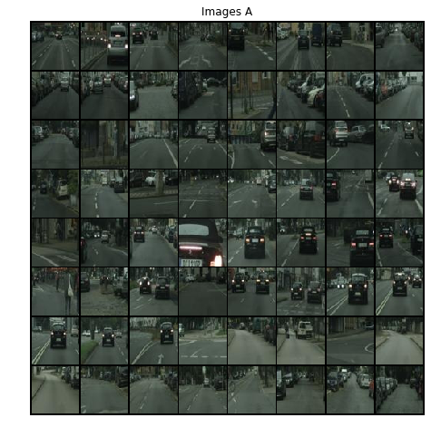
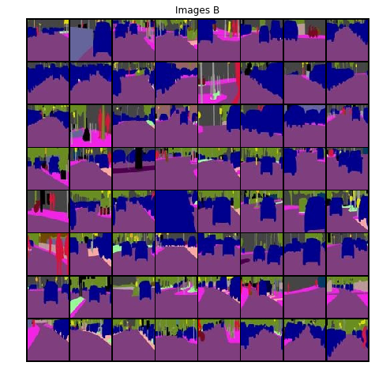
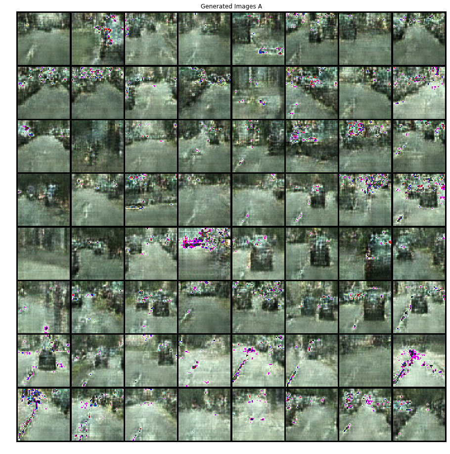
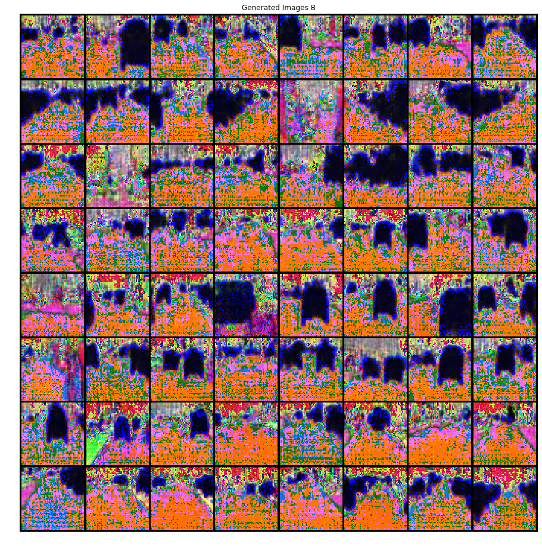

CycleGAN Tutorial
=================

**Author** - `Avik Pal <https://avik-pal.github.io/>`__

This is an **ADVANCED TUTORIAL** and it is recommended to go through the
previous set of tutorials which cover the basics of torchgan. In this
tutorial we shall be implementing the paper `Unpaired Image-to-Image
Translation using Cycle-Consistent Adversarial Networks by Zhu et.
al. <https://arxiv.org/abs/1703.10593>`__.

Since this is a fairly advanced model, we will have to subclass most of
the features provided by torchgan. The tutorial can be broadly
categorized into 3 major components:

1. The Generator and the Discriminator Models
2. The Loss Functions
3. A Custom Trainer

We also need to write our own DataLoader for the **cityscapes** dataset.
It is fairly simple to modify the DataLoader to support other datasets
and we would highly encourage you to do so in order to get more familiar
with the way *torchgan and Pytorch in general work*.

.. code:: ipython3

    import os, sys, glob, random
    import numpy as np
    import torch
    import torch.nn as nn
    import torch.nn.functional as F
    from torch.optim import Adam
    from torch.utils.data import Dataset, DataLoader
    from PIL import Image
    import torchvision.transforms as transforms
    import torchvision.utils as vutils
    import torchgan
    from torchgan.models import Generator, Discriminator
    from torchgan.trainer import Trainer
    from torchgan.losses import GeneratorLoss, DiscriminatorLoss,\
                                least_squares_generator_loss, least_squares_discriminator_loss
    import matplotlib.pyplot as plt
    %matplotlib inline

.. code:: ipython3

    # Set random seed for reproducibility
    manualSeed = 999
    random.seed(manualSeed)
    torch.manual_seed(manualSeed)
    print("Random Seed: ", manualSeed)

.. parsed-literal::

    Random Seed:  999

Loading the Dataset
-------------------

We are going to work with the **Cityscapes Data**. You should use `this
script <https://github.com/junyanz/pytorch-CycleGAN-and-pix2pix/blob/master/datasets/download_cyclegan_dataset.sh>`__
to download the data.

The downloaded data should be present in the following format:

::

       ---> cityscapes
           ---> trainA
               ---> ...
               ---> ...
                   .
                   .
                   .
           ---> trainB
               ---> ...
               ---> ...
                   .
                   .
                   .
           ---> testA
               ---> ...
               ---> ...
                   .
                   .
                   .
           ---> testB
               ---> ...
               ---> ...
                   .
                   .
                   .

The ``...`` signify the image files. For the sake of this tutorial we
will only make use of the ``train`` files, though ideally for inference
you should be using the ``test`` files.

As you can observe that the ``__getitem__`` function returns a ``dict``.
This is a vital detail. The reson for this shall be explained when we
will subclass the ``Trainer``. But remember that sending a ``list`` or
``tuple`` will create issues for our code.

.. code:: ipython3

    class ImageDataset(Dataset):
        def __init__(self, root, transform=None, mode='train'):
            self.transform = transform
            self.files_A = sorted(glob.glob(os.path.join(root, '{}A'.format(mode)) + '/*.*'))
            self.files_B = sorted(glob.glob(os.path.join(root, '{}B'.format(mode)) + '/*.*'))

        def __getitem__(self, index):
            item_A = self.transform(Image.open(self.files_A[index % len(self.files_A)]))
            item_B = self.transform(Image.open(self.files_B[index % len(self.files_B)]))
            return {'A': item_A, 'B': item_B}

        def __len__(self):
            return max(len(self.files_A), len(self.files_B))

.. code:: ipython3

    dataset = ImageDataset("./datasets/cityscapes",
                           transform=transforms.Compose([transforms.CenterCrop((64, 64)),
                                                         transforms.ToTensor(),
                                                         transforms.Normalize(mean=(0.5, 0.5, 0.5),
                                                                              std=(0.5, 0.5, 0.5))]))

This ``batch_size`` works on a **12GB Nvidia 1080Ti GPU**. If you are
trying this notebook in a less powerful machine please reduce the
batch_size otherwise you will most likely encounter a CUDA Out Of Memory
Issue.

.. code:: ipython3

    dataloader = DataLoader(dataset, batch_size=64, shuffle=False, num_workers=8)

Visualize the Training Data
---------------------------

Lets display the pictures that will serve as our training dataset. We
will simultaneously train 2 generators, **gen_a2b** and **gen_b2a**.
**gen_a2b** will learn to translate images of **type A** (the normal
images) to images of **type B** (the segmented images). **gen_b2a** will
learn to do the reverse translation.

**Note**: *Even though we are using paired images in this tutorial,
CycleGAN can work with Unpaired Data. For some datasets you shall not
have paired images, so feel free to use unpaired data. Only thing to
take into account would be to use some randomization while selected the
image pair in such a scenario. The easiest way would be to replace the
selection line for image_B to
``np.random.randint(0, len(self.files_B))``*

.. code:: ipython3

    a = next(iter(dataloader))

.. code:: ipython3

    plt.figure(figsize=(8,8))
    plt.axis("off")
    plt.title("Images A")
    plt.imshow(np.transpose(vutils.make_grid(a['A'].to(torch.device("cuda:0"))[:64], padding=2, normalize=True).cpu(),(1,2,0)))
    plt.show()
    plt.figure(figsize=(8,8))
    plt.axis("off")
    plt.title("Images B")
    plt.imshow(np.transpose(vutils.make_grid(a['B'].to(torch.device("cuda:0"))[:64], padding=2, normalize=True).cpu(),(1,2,0)))
    plt.show()

Defining the Generator & Discriminator
--------------------------------------

First we will be defining the building blocks of the model. TorchGAN
provides standard ResidualBlocks however, we need a specific form of
ResidualBlock for CycleGAN model. In the paper `Instance Normalization:
The Missing Ingredient for Fast Stylization by Ulyanov et.
al. <https://arxiv.org/abs/1607.08022>`__, the authors describe the use
of Instance Normalization for Style Transfer. On a similar context, we
shall be using Instance Norm instead of Batch Norm and finally swap the
**Zero Padding** of the Convolutional Layer with **Reflection Padding**.

.. code:: ipython3

    class ResidualBlock(nn.Module):
        def __init__(self, in_features):
            super(ResidualBlock, self).__init__()
            self.conv_block = nn.Sequential(nn.ReflectionPad2d(1),
                                            nn.Conv2d(in_features, in_features, 3),
                                            nn.InstanceNorm2d(in_features),
                                            nn.ReLU(inplace=True),
                                            nn.ReflectionPad2d(1),
                                            nn.Conv2d(in_features, in_features, 3),
                                            nn.InstanceNorm2d(in_features))

        def forward(self, x):
            return x + self.conv_block(x)

The **CycleGAN Generator** has 3 parts:

1. A downsampling network: It is composed of 3 convolutional layers
   (together with the regular padding, normalization and activation
   layers).
2. A chain of residual networks built using the Residual Block. You can
   try to vary the ``res_blocks`` parameter and see the results.
3. A upsampling network: It is composed of 3 transposed convolutional
   layers.

We also need to define a ``sampler`` function which provides a visual
standard for seeing how the generator is performing. The sampler must
receive 2 inputs ``sample_size`` and ``device`` and it should return a
list of the arguments needed by the ``forward`` function of the
generator

.. code:: ipython3

    class CycleGANGenerator(Generator):
        def __init__(self, image_batch, in_channels=3, out_channels=3, res_blocks=5):
            super(CycleGANGenerator, self).__init__(in_channels)

            self.image_batch = image_batch

            # Initial convolution block
            model = [nn.ReflectionPad2d(3), nn.Conv2d(in_channels, 64, 7),
                     nn.InstanceNorm2d(64), nn.ReLU(inplace=True)]

            # Downsampling
            in_features = 64
            out_features = in_features * 2
            for _ in range(2):
                model += [nn.Conv2d(in_features, out_features, 4, stride=2, padding=1),
                          nn.InstanceNorm2d(out_features), nn.ReLU(inplace=True)]
                in_features = out_features
                out_features = in_features * 2

            # Residual blocks
            for _ in range(res_blocks):
                model += [ResidualBlock(in_features)]

            # Upsampling
            out_features = in_features // 2
            for _ in range(2):
                model += [nn.ConvTranspose2d(in_features, out_features, 4, stride=2, padding=1),
                          nn.InstanceNorm2d(out_features), nn.ReLU(inplace=True)]
                in_features = out_features
                out_features = in_features // 2

            # Output layer
            model += [nn.ReflectionPad2d(3), nn.Conv2d(64, out_channels, 7), nn.Tanh()]

            self.model = nn.Sequential(*model)

            self._weight_initializer()

        def forward(self, x):
            return self.model(x)

        def sampler(self, sample_size, device):
            return [self.image_batch.to(device)]

The **CycleGAN Discriminator** is like the standard DCGAN Discriminator.
The only difference is the normalization used. Just like in the
Generator we shall be using Instance Normalization even in the
Discriminator.

.. code:: ipython3

    class CycleGANDiscriminator(Discriminator):
        def __init__(self, in_channels=3):
            super(Discriminator, self).__init__()

            def discriminator_block(in_filters, out_filters, normalize=True):
                layers = [nn.Conv2d(in_filters, out_filters, 4, stride=2, padding=1)]
                if normalize:
                    layers.append(nn.InstanceNorm2d(out_filters))
                layers.append(nn.LeakyReLU(0.2, inplace=True))
                return layers

            self.model = nn.Sequential(
                *discriminator_block(in_channels, 64, normalize=False),
                *discriminator_block(64, 128),
                *discriminator_block(128, 256),
                *discriminator_block(256, 512),
                nn.ZeroPad2d((1, 0, 1, 0)),
                nn.Conv2d(512, 1, 4, padding=1))

            self._weight_initializer()

        def forward(self, x):
            return self.model(x)

Loss Functions
--------------

The Generator Loss is composed of 3 parts. They are described below:

1. **GAN Loss**: It is the standard generator loss of the Least Squares
   GAN. We use the functional forms of the losses to implement this
   part.

   .. math:: L_{GAN} = \frac{1}{4} \times ((D_A(G_{B2A}(Image_B)) - 1)^2 + (D_B(G_{A2B}(Image_A)) - 1)^2)

2. **Identity Loss**: It computes the similarity of a real image of type
   B and a fake image B generated from image A and vice versa. The
   similarity is measured using the :math:`L_1` Loss.

   .. math:: L_{identity} = \frac{1}{2} \times (||G_{B2A}(Image_B) - Image_A||_1 + ||G_{A2B}(Image_A) - Image_B||_1)

3. **Cycle Consistency Loss**: This loss computes the similarity of the
   original image and the image generated by a composition of the 2
   generators. This allows cyclegan to deak with unpaired images. We
   reconstruct the original image and try to minimize the :math:`L_1`
   norm between the original images and this reconstructed image.

   .. math:: L_{cycle\_consistency} = \frac{1}{2} \times (||G_{B2A}(G_{A2B}(Image_A)) - Image_A||_1 + ||G_{A2B}(G_{B2A}(Image_B)) - Image_B||_1)

The losses can be decomposed into 3 different loss functions, however,
doing that would not be in our best interests. In that case we shall be
backpropagating 3 times through the networks. This will lead to a huge
impact in the performance of your code. So the general rule in torchgan
is to club losses together if they improve the performance of your model
otherwise keep them seperate (this will lead to better loss
visualization) and feed them in through the losses list.

Now let us see the naming convention for the ``train_ops`` arguments. We
simply list all the variables stored in the Trainer that we need. We are
guaranteed to get all these variables if they are present in the
Trainer. In case something is not, you shall receive a well defined
error message stating which argument was not found. Then you can define
that argument or use the ``set_arg_map`` to fix that. The details of
this method is clearly demonstrated in the documentation.

.. code:: ipython3

    class CycleGANGeneratorLoss(GeneratorLoss):
        def train_ops(self, gen_a2b, gen_b2a, dis_a, dis_b, optimizer_gen_a2b, optimizer_gen_b2a,
                      image_a, image_b):
            optimizer_gen_a2b.zero_grad()
            optimizer_gen_b2a.zero_grad()
            fake_a = gen_b2a(image_b)
            fake_b = gen_a2b(image_a)
            loss_identity = 0.5 * (F.l1_loss(fake_a, image_a) + F.l1_loss(fake_b, image_b))
            loss_gan = 0.5 * (least_squares_generator_loss(dis_a(fake_a)) +\
                       least_squares_generator_loss(dis_b(fake_b)))
            loss_cycle_consistency = 0.5 * (F.l1_loss(gen_a2b(fake_a), image_b) +\
                                     F.l1_loss(gen_b2a(fake_b), image_a))
            loss = loss_identity + loss_gan + loss_cycle_consistency
            loss.backward()
            optimizer_gen_a2b.step()
            optimizer_gen_b2a.step()
            return loss.item()

The Discriminator as mentioned before is same as the normal DCGAN
Discriminator. As such even the loss function for that is same as that
of the standard GAN. Again we list all the required variables in the
train_ops and we are guaranteed to get those from the Trainer.

.. math:: L_{GAN} = \frac{1}{4} \times (((D_A(Image_A) - 1)^2 - (D_A(G_{B2A}(Image_B))^2) + ((D_B(Image_B) - 1)^2 - (D_B(G_{A2B}(Image_A))^2))

.. code:: ipython3

    class CycleGANDiscriminatorLoss(DiscriminatorLoss):
        def train_ops(self, gen_a2b, gen_b2a, dis_a, dis_b, optimizer_dis_a, optimizer_dis_b,
                      image_a, image_b):
            optimizer_dis_a.zero_grad()
            optimizer_dis_b.zero_grad()
            fake_a = gen_b2a(image_b).detach()
            fake_b = gen_a2b(image_a).detach()
            loss = 0.5 * (least_squares_discriminator_loss(dis_a(image_a), dis_a(fake_a)) +
                          least_squares_discriminator_loss(dis_b(image_b), dis_b(fake_b)))
            loss.backward()
            optimizer_dis_a.step()
            optimizer_dis_b.step()
            return loss.item()

Defining the Custom Trainer for CycleGAN
----------------------------------------

Even though the Trainer has been designed to be as general as possible,
it cannot handle arbitrary input data format. However, the current
design provides a neat trick to by-pass this shortcoming. The data is
handled in 3 different ways:

1. If it is a list or tuple, then *real_inputs* stores the first element
   and *labels* stores the second element. Since we expect these to be
   tensors we push them to device. This might be troublesome in cases
   where the input data from the data loader is not a tensor, but even
   that can be handled.
2. If it is a torch Tensor we simply save it in the *real_inputs* and is
   pushed to the device.
3. Now the :math:`3^{rd}` and the most interesting one. In case any of
   the above are not satisfied we shall be storing the data in
   *real_inputs*. Note that we leave this format completely untouched.
   So you can do anything that you need to do with it. Hence we
   recommend that if you have custom data use a dictionary to fetch it.

Now lets come to the trick I mentioned before. Since we defined our
dataset to return ``dict``. We are now guaranteed to have the untouched
data in a variable named ``real_inputs``. So we simply redefine the
``train_iter_custom`` function which is called everytime before we call
the ``train_iter``. In this function we shall simply unpack the data
into 2 variables ``image_a`` and ``image_b``, exactly what the
``train_ops`` needed.

.. code:: ipython3

    class CycleGANTrainer(Trainer):
        def train_iter_custom(self):
            self.image_a = self.real_inputs['A'].to(self.device)
            self.image_b = self.real_inputs['B'].to(self.device)

.. code:: ipython3

    device = torch.device("cuda:0")

``image_batch`` will act as a reference and we can visualize its
transformation over the course of the model training.

.. code:: ipython3

    image_batch = next(iter(dataloader))

.. code:: ipython3

    network_config = {
        "gen_a2b": {"name": CycleGANGenerator, "args": {"image_batch": image_batch['A']},
                    "optimizer": {"name": Adam, "args": {"lr": 0.0001, "betas": (0.5, 0.999)}}},
        "gen_b2a": {"name": CycleGANGenerator, "args": {"image_batch": image_batch['B']},
                    "optimizer": {"name": Adam, "args": {"lr": 0.0001, "betas": (0.5, 0.999)}}},
        "dis_a": {"name": CycleGANDiscriminator,
                  "optimizer": {"name": Adam, "args": {"lr": 0.0001, "betas": (0.5, 0.999)}}},
        "dis_b": {"name": CycleGANDiscriminator,
                  "optimizer": {"name": Adam, "args": {"lr": 0.0001, "betas": (0.5, 0.999)}}}
    }

.. code:: ipython3

    losses = [CycleGANGeneratorLoss(), CycleGANDiscriminatorLoss()]

Another important detail is the last 2 arguments. Since at the time of
instantiation we shall be checking if all the variables required by the
train_ops are present in the trainer, we need to make sure that the
object has some attributes named ``image_a`` and ``image_b``. The
trainer stores any keyword argument that it receives, hence this is the
simplest way to prevent that error

.. code:: ipython3

    trainer = CycleGANTrainer(network_config, losses, device=device, epochs=100, image_a=None, image_b=None)

.. code:: ipython3

    trainer(dataloader)

.. parsed-literal::

    Saving Model at './model/gan0.model'

.. parsed-literal::

    /data/avikpal/miniconda3/lib/python3.7/site-packages/torch/serialization.py:241: UserWarning: Couldn't retrieve source code for container of type CycleGANGeneratorLoss. It won't be checked for correctness upon loading.
      "type " + obj.__name__ + ". It won't be checked "
    /data/avikpal/miniconda3/lib/python3.7/site-packages/torch/serialization.py:241: UserWarning: Couldn't retrieve source code for container of type CycleGANDiscriminatorLoss. It won't be checked for correctness upon loading.
      "type " + obj.__name__ + ". It won't be checked "

.. parsed-literal::

    Epoch 1 Summary
    gen_a2b Mean Gradients : 25.373855783972246
    gen_b2a Mean Gradients : 39.881884383987945
    dis_a Mean Gradients : 9.00916113148021
    dis_b Mean Gradients : 5.737849600937892
    Mean Running Discriminator Loss : 0.5342410517499802
    Mean Running Generator Loss : 1.075072907386942
    Generating and Saving Images to ./images/epoch1_gen_a2b.png
    Generating and Saving Images to ./images/epoch1_gen_b2a.png

    Saving Model at './model/gan1.model'
    Epoch 2 Summary
    gen_a2b Mean Gradients : 14.481977953249341
    gen_b2a Mean Gradients : 22.743691111338652
    dis_a Mean Gradients : 5.784760900086345
    dis_b Mean Gradients : 5.197409447200781
    Mean Running Discriminator Loss : 0.45670214897774636
    Mean Running Generator Loss : 0.9196841570925205
    Generating and Saving Images to ./images/epoch2_gen_a2b.png
    Generating and Saving Images to ./images/epoch2_gen_b2a.png

    Saving Model at './model/gan2.model'
    Epoch 3 Summary
    gen_a2b Mean Gradients : 10.391435876424984
    gen_b2a Mean Gradients : 16.175424935190154
    dis_a Mean Gradients : 4.392509185301861
    dis_b Mean Gradients : 4.2144130877959425
    Mean Running Discriminator Loss : 0.4083263345643984
    Mean Running Generator Loss : 0.8391667536809935
    Generating and Saving Images to ./images/epoch3_gen_a2b.png
    Generating and Saving Images to ./images/epoch3_gen_b2a.png

    Saving Model at './model/gan3.model'
    Epoch 4 Summary
    gen_a2b Mean Gradients : 8.309282641969938
    gen_b2a Mean Gradients : 12.736808601595108
    dis_a Mean Gradients : 3.635182213739573
    dis_b Mean Gradients : 3.708855506469772
    Mean Running Discriminator Loss : 0.3773534358181852
    Mean Running Generator Loss : 0.79380923097438
    Generating and Saving Images to ./images/epoch4_gen_a2b.png
    Generating and Saving Images to ./images/epoch4_gen_b2a.png

    Saving Model at './model/gan4.model'
    Epoch 5 Summary
    gen_a2b Mean Gradients : 6.990355745791801
    gen_b2a Mean Gradients : 10.607332475437852
    dis_a Mean Gradients : 3.1933581583695756
    dis_b Mean Gradients : 3.333453752180988
    Mean Running Discriminator Loss : 0.3560242209662782
    Mean Running Generator Loss : 0.7643321940239439
    Generating and Saving Images to ./images/epoch5_gen_a2b.png
    Generating and Saving Images to ./images/epoch5_gen_b2a.png

    Saving Model at './model/gan0.model'
    Epoch 6 Summary
    gen_a2b Mean Gradients : 6.114053221152256
    gen_b2a Mean Gradients : 9.217389959797684
    dis_a Mean Gradients : 2.898909944011694
    dis_b Mean Gradients : 3.1686936661822167
    Mean Running Discriminator Loss : 0.34035523573980264
    Mean Running Generator Loss : 0.7432212761953367
    Generating and Saving Images to ./images/epoch6_gen_a2b.png
    Generating and Saving Images to ./images/epoch6_gen_b2a.png

    Saving Model at './model/gan1.model'
    Epoch 7 Summary
    gen_a2b Mean Gradients : 5.579122994887401
    gen_b2a Mean Gradients : 8.189018802753926
    dis_a Mean Gradients : 2.729340600566509
    dis_b Mean Gradients : 3.0616053132159933
    Mean Running Discriminator Loss : 0.32857765406823086
    Mean Running Generator Loss : 0.7274501698720056
    Generating and Saving Images to ./images/epoch7_gen_a2b.png
    Generating and Saving Images to ./images/epoch7_gen_b2a.png

    Saving Model at './model/gan2.model'
    Epoch 8 Summary
    gen_a2b Mean Gradients : 5.165604317050728
    gen_b2a Mean Gradients : 7.421897914940533
    dis_a Mean Gradients : 2.5641339160383896
    dis_b Mean Gradients : 2.8709736399409627
    Mean Running Discriminator Loss : 0.31935914257105363
    Mean Running Generator Loss : 0.7136180786851872
    Generating and Saving Images to ./images/epoch8_gen_a2b.png
    Generating and Saving Images to ./images/epoch8_gen_b2a.png

Visualizing the Generated Data
------------------------------

.. code:: ipython3

    plt.figure(figsize=(16,16))
    plt.axis("off")
    plt.title("Generated Images A")
    plt.imshow(plt.imread("{}/epoch{}_gen_b2a.png".format(trainer.recon, trainer.epochs)))
    plt.show()
    plt.figure(figsize=(16,16))
    plt.axis("off")
    plt.title("Generated Images B")
    plt.imshow(plt.imread("{}/epoch{}_gen_a2b.png".format(trainer.recon, trainer.epochs)))
    plt.show()

