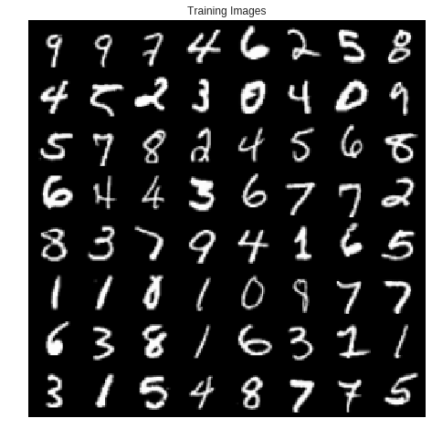
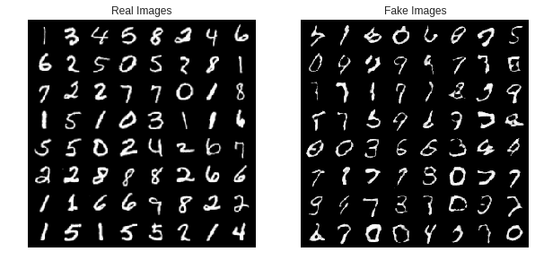

Introducing TorchGAN
====================

**Author** - `Aniket Das <https://aniket1998.github.io>`__

`Try this tutorial on
colab <https://colab.research.google.com/drive/19rDnX2VF9BW94AG48UbZp5btkv5KT2eo>`__

This tutorial introduces you to the basics of
`TorchGAN <https://github.com/torchgan/torchgan>`__ to define, train and
evaluate **Generative Adversarial Networks** easily in **PyTorch**. This
tutorial mainly explores the library's core features, the predefined
losses and the models. TorchGAN is designed to be highly and very easily
extendable and at the end of the tutorial, we see how seamlessly you can
integrate your own custom losses and models into the API's training loop

This tutorial assumes that your system has **PyTorch** and **TorchGan**
installed properly. If not, head over to the installation instructions
on the `official documentation
website <https://torchgan.readthedocs.io/en/latest/>`__.

Imports
-------

.. code:: python3

    # General Imports
    import os
    import random
    import matplotlib.pyplot as plt
    import matplotlib.animation as animation
    import numpy as np
    from IPython.display import HTML
    # Pytorch and Torchvision Imports
    import torch
    import torch.nn as nn
    import torchvision
    from torch.optim import Adam
    import torch.nn as nn
    import torch.utils.data as data
    import torchvision.datasets as dsets
    import torchvision.transforms as transforms
    import torchvision.utils as vutils
    # Torchgan Imports
    import torchgan
    from torchgan.models import *
    from torchgan.losses import *
    from torchgan.trainer import Trainer

.. code:: python3

    # Set random seed for reproducibility
    manualSeed = 999
    random.seed(manualSeed)
    torch.manual_seed(manualSeed)
    print("Random Seed: ", manualSeed)

.. parsed-literal::

    Random Seed:  999

Data Loading and Preprocessing
------------------------------

This tutorial uses the **MNIST** dataset for illustration purposes and
convergence time issues. We apply the following transformations to the
raw dataset to speed up training 1. MNIST digits have a size of
:math:`28 \times 28` by default. The default models present in
**TorchGAN** assume that the image dimensions are a perfect power of 2
(though this behavior can be very easily overriden). For the purposes of
this tutorial where we use the default models out of the box, we rescale
the images to :math:`32 \times 32` 2. The images are normalized with a
mean and standard deviation of 0.5 for each channel. This has been
observed to enable easier training (one can also choose to normalize
with the per channel mean and standard deviation)

We then wrap the dataset in a **DataLoader**. This is done because
**TorchGAN Trainer** , which shall be explored in later sections
requires said DataLoader to be passed as a parameter while training

.. code:: python3

    dataset = dsets.MNIST(root='./mnist', train=True,
                          transform=transforms.Compose([transforms.Resize((32, 32)),
                                                        transforms.ToTensor(),
                                                        transforms.Normalize(mean = (0.5, 0.5, 0.5), std = (0.5, 0.5, 0.5))]),
                          download=True)

.. code:: python3

    dataloader = data.DataLoader(dataset, batch_size=64, shuffle=True)

Network Architecture : DCGAN
----------------------------

This tutorial uses the highly popular Deep Convolutional GAN or DCGAN
architecture. **TorchGAN** provides a generalised implementation of
DCGAN out of the box.

Generator Network
~~~~~~~~~~~~~~~~~

The DCGAN Generator receives an input noise vector of size
:math:`batch\ size \times encoding\ dims`. It outputs a tensor of
:math:`batch\ size \times 1 \times 32 \times 32` corresponding to a
batch of generated image samples. The generator transforms the noise
vector into images in the following manner 1. **Channel Dimension**:
:math:`encoding\ dims \rightarrow d \rightarrow \frac{d}{2} \rightarrow \frac{d}{4} \rightarrow 1`.
2. **Image size**:
:math:`(1 \times 1) \rightarrow (4 \times 4) \rightarrow (8 \times 8) \rightarrow (16 \times 16) \rightarrow (32 \times 32)`.

The intermediate layers use the **Leaky ReLU** activation function as
ReLU tends to kill gradients and critically slow down convergence. One
can also use activation functions such as **ELU** or any other
activation of choice that ensures good gradient flow. The last layer
uses a $ tanh $ activation in order to constrain the pixel values in the
range :math:`(-1 \to 1)` . One can easily change the nonlinearity of the
intermediate and the last layers as per their preference by passing them
as parameters during initialization of the Generator object.

Discriminator Network
~~~~~~~~~~~~~~~~~~~~~

The DCGAN discriminator has an architecture symmetric to the generator.
It maps the image to a confidence score in order to classify whether the
image is real (i.e. comes from the dataset) or fake (i. e. sampled by
the generator)

For reasons same as above we use a **Leaky ReLU** activation. The
conversion of the image tensor to the confidence scores are as follows:

1. **Channel Dimension**:
   :math:`1 \rightarrow d \rightarrow 2 \times d \rightarrow 4 \times d \rightarrow 1`.
2. **Image size**:
   :math:`(32 \times 32) \rightarrow (16 \times 16) \rightarrow (8 \times 8) \rightarrow (4 \times 4) \rightarrow (1 \times 1)`.

*Note: The last layer of the discriminator in most standard
implementations of DCGAN have a Sigmoid layer that causes the confidence
scores to lie in the interval :math:`(0 \to 1)` and allows the easy
interpretation of the confidence score as the probability of the image
being real. However, this interpretation is only restricted to the
Minimax Loss proposed in the original GAN paper and losses such as the
Wasserstein Loss do not require such an interpretation. If required,
however, one can easily set the activation of the last layer to Sigmoid
by passing it as a parameter during initialization time*

Optimizers and Hyperparameters
------------------------------

The models, their corresponding optimizers and other hyperparameters
like the nonlinearities to be used in the intermediate layers are
bundled in the form of a dictionary and provided to the trainer for
instantiation. The dictionary specifies the models that are to be
trained, the optimizers associated with said models and learning rate
schedulers, if any

1. "name": The class name for the model. Generally a subclass of the
   ``torchgan.models.Generator`` or ``torchgan.models.Discriminator``
2. "args": Arguments fed into the class during instantiation, into its
   constructor
3. "optimizer": A dictionary containing the following key-value pairs
   defining the optimizer associated with the model

   -  "name" : The class name of the optimizer. Generally an optimizer
      from the ``torch.optim`` package
   -  "args" : Arguments to be fed to the optimizer during its
      instantiation, into its constructor
   -  "var": Variable name for the optimizer. This is an optional
      argument. If this is not provided, we assign the optimizer the
      name ``optimizer_{}`` where {} refers to the variable name of the
      model.
   -  "scheduler": Optional scheduler associated with the optimizer.
      Again this is a dictionary with the following keys

      -  "name" : Class name of the scheduler
      -  "args" : Arguments to be provided to the scheduler during
         instantiation, into its constructor

This tutorial shows the example for a DCGAN optimized by the Adam
optimizer. Head over to the documentation of ``DCGANGenerator`` ,
``DCGANDiscriminator`` or the ``torch.optim.Adam`` classes for more
details about what each of the args mean (*NB: The args are basically
parameters to the constructor of each class declared in "name" , as
discussed before* ). Also try tinkering with the various hyperparameters
like *"encoding\_dims", "step\_channels", "nonlinearity" and
"last\_nonlinearity"*

.. code:: python3

    dcgan_network = {
        "generator": {
            "name": DCGANGenerator,
            "args": {
                "encoding_dims": 100,
                "out_channels": 1,
                "step_channels": 32,
                "nonlinearity": nn.LeakyReLU(0.2),
                "last_nonlinearity": nn.Tanh()
            },
            "optimizer": {
                "name": Adam,
                "args": {
                    "lr": 0.0001,
                    "betas": (0.5, 0.999)
                }
            }
        },
        "discriminator": {
            "name": DCGANDiscriminator,
            "args": {
                "in_channels": 1,
                "step_channels": 32,
                "nonlinearity": nn.LeakyReLU(0.2),
                "last_nonlinearity": nn.LeakyReLU(0.2)
            },
            "optimizer": {
                "name": Adam,
                "args": {
                    "lr": 0.0003,
                    "betas": (0.5, 0.999)
                }
            }
        }
    }

Loss Functions
--------------

**TorchGAN** provides a wide variety of GAN losses and penalties off the
shelf. One can also easily implement custom losses and integrate it with
the highly robust training pipeline

1. Minimax Loss
2. Wasserstein GAN with Gradient Penalty
3. Least Squares GAN or LSGAN

The loss objects to be used by the trainer are added in a list as shown

.. code:: python3

    minimax_losses = [MinimaxGeneratorLoss(), MinimaxDiscriminatorLoss()]
    wgangp_losses = [WassersteinGeneratorLoss(), WassersteinDiscriminatorLoss(), WassersteinGradientPenalty()]
    lsgan_losses = [LeastSquaresGeneratorLoss(), LeastSquaresDiscriminatorLoss()]

Visualize the Training Data
---------------------------

.. code:: python3

    # Plot some of the training images
    real_batch = next(iter(dataloader))
    plt.figure(figsize=(8,8))
    plt.axis("off")
    plt.title("Training Images")
    plt.imshow(np.transpose(vutils.make_grid(real_batch[0][:64], padding=2, normalize=True).cpu(),(1,2,0)))
    plt.show()

Training the Network
--------------------

*NB: Training the models are quite expensive. Hence we will train the
models for **40** epochs if a GPU is available, else we will be training
for only **5** epochs. We recommend using the **GPU runtime** in Colab.
The images will not look even close to realistic in **5** epochs but
shall be enough to show that it is learning to generate good quality
images. *

--------------

The trainer is initialized by passing the network descriptors and the
losses, and then calling the trainer on the dataset. The *sample\_size*
parameter decides how many images to sample for visualization at the end
of every epoch, and the *epochs* parameter decides the number of epochs.
We illustrate the training process by training an LSGAN. Simply change
the losses list passed from *lsgan\_losses* to *wgangp\_losses* to train
a Wasserstein GAN with Gradient Penalty, or to *minimax\_losses* to
train a Minimax GAN

--------------

Important information for visualizing the performance of the GAN is
printed to the console. We also provide a **Visualizer API** for
visualizing the various losses, gradient flow and generated images.
Setting up the Visualizer using either a **TensorboardX** or **Vizdom**
backend is the recommended approach for visualizing the training
process.

.. code:: python3

    if torch.cuda.is_available():
        device = torch.device("cuda:0")
        # Use deterministic cudnn algorithms
        torch.backends.cudnn.deterministic = True
        epochs = 40
    else:
        device = torch.device("cpu")
        epochs = 5

    print("Device: {}".format(device))
    print("Epochs: {}".format(epochs))

.. parsed-literal::

    Device: cuda:0
    Epochs: 40

.. code:: python3

    trainer = Trainer(dcgan_network, lsgan_losses, sample_size=64, epochs=epochs, device=device)

.. code:: python3

    trainer(dataloader)

.. parsed-literal::

    Saving Model at './model/gan0.model'
    Epoch 1 Summary
    generator Mean Gradients : 3.3601897621992705
    discriminator Mean Gradients : 12.766687169466184
    Mean Running Discriminator Loss : 0.031985868796158126
    Mean Running Generator Loss : 0.5773591010301098
    Generating and Saving Images to ./images/epoch1_generator.png

    Saving Model at './model/gan1.model'
    Epoch 2 Summary
    generator Mean Gradients : 1.871107902676975
    discriminator Mean Gradients : 9.4076550166002
    Mean Running Discriminator Loss : 0.01971807123669711
    Mean Running Generator Loss : 0.5551951952707539
    Generating and Saving Images to ./images/epoch2_generator.png

    Saving Model at './model/gan2.model'
    Epoch 3 Summary
    generator Mean Gradients : 1.2931722159886285
    discriminator Mean Gradients : 8.156814747416435
    Mean Running Discriminator Loss : 0.014949400106872887
    Mean Running Generator Loss : 0.543896336301727
    Generating and Saving Images to ./images/epoch3_generator.png

    Saving Model at './model/gan3.model'
    Epoch 4 Summary
    generator Mean Gradients : 0.989492404738369
    discriminator Mean Gradients : 7.404026172291571
    Mean Running Discriminator Loss : 0.012354827420758718
    Mean Running Generator Loss : 0.5377227021083395
    Generating and Saving Images to ./images/epoch4_generator.png

    Saving Model at './model/gan4.model'
    Epoch 5 Summary
    generator Mean Gradients : 0.8113258096916265
    discriminator Mean Gradients : 6.968548609093946
    Mean Running Discriminator Loss : 0.010800301655791879
    Mean Running Generator Loss : 0.5340571434703717
    Generating and Saving Images to ./images/epoch5_generator.png

    Saving Model at './model/gan0.model'
    Epoch 6 Summary
    generator Mean Gradients : 0.6939287251648949
    discriminator Mean Gradients : 6.916873545018266
    Mean Running Discriminator Loss : 0.01005528816748437
    Mean Running Generator Loss : 0.5316294223101917
    Generating and Saving Images to ./images/epoch6_generator.png

    Saving Model at './model/gan1.model'
    Epoch 7 Summary
    generator Mean Gradients : 0.8438198651007175
    discriminator Mean Gradients : 10.193058347935482
    Mean Running Discriminator Loss : 0.014311864309791877
    Mean Running Generator Loss : 0.5250494302231439
    Generating and Saving Images to ./images/epoch7_generator.png

    Saving Model at './model/gan2.model'
    Epoch 8 Summary
    generator Mean Gradients : 1.0894166825089557
    discriminator Mean Gradients : 11.113694709476995
    Mean Running Discriminator Loss : 0.015416002067648418
    Mean Running Generator Loss : 0.5207196538215444
    Generating and Saving Images to ./images/epoch8_generator.png

    Saving Model at './model/gan3.model'
    Epoch 9 Summary
    generator Mean Gradients : 1.3858154403670682
    discriminator Mean Gradients : 11.335656136087621
    Mean Running Discriminator Loss : 0.015638350666809745
    Mean Running Generator Loss : 0.5183545941408848
    Generating and Saving Images to ./images/epoch9_generator.png

    Saving Model at './model/gan4.model'
    Epoch 10 Summary
    generator Mean Gradients : 1.6442126975049174
    discriminator Mean Gradients : 11.3057502214912
    Mean Running Discriminator Loss : 0.015519619032220324
    Mean Running Generator Loss : 0.5169296721691516
    Generating and Saving Images to ./images/epoch10_generator.png

    Saving Model at './model/gan0.model'
    Epoch 11 Summary
    generator Mean Gradients : 1.8553281750891084
    discriminator Mean Gradients : 11.391180433567362
    Mean Running Discriminator Loss : 0.015575504728206973
    Mean Running Generator Loss : 0.5157191250094161
    Generating and Saving Images to ./images/epoch11_generator.png

    Saving Model at './model/gan1.model'
    Epoch 12 Summary
    generator Mean Gradients : 2.064539237595944
    discriminator Mean Gradients : 11.17662853537689
    Mean Running Discriminator Loss : 0.01522397245011953
    Mean Running Generator Loss : 0.5148798804485266
    Generating and Saving Images to ./images/epoch12_generator.png

    Saving Model at './model/gan2.model'
    Epoch 13 Summary
    generator Mean Gradients : 2.233709755689889
    discriminator Mean Gradients : 11.02748042057442
    Mean Running Discriminator Loss : 0.01501067319203016
    Mean Running Generator Loss : 0.5141561355179688
    Generating and Saving Images to ./images/epoch13_generator.png

    Saving Model at './model/gan3.model'
    Epoch 14 Summary
    generator Mean Gradients : 2.399089187152185
    discriminator Mean Gradients : 11.004506427541662
    Mean Running Discriminator Loss : 0.014991896495789272
    Mean Running Generator Loss : 0.5136049601600877
    Generating and Saving Images to ./images/epoch14_generator.png

    Saving Model at './model/gan4.model'
    Epoch 15 Summary
    generator Mean Gradients : 2.5529934227724405
    discriminator Mean Gradients : 10.718491946990284
    Mean Running Discriminator Loss : 0.014592011164153668
    Mean Running Generator Loss : 0.5132594303927611
    Generating and Saving Images to ./images/epoch15_generator.png

    Saving Model at './model/gan0.model'
    Epoch 16 Summary
    generator Mean Gradients : 2.693718411103624
    discriminator Mean Gradients : 10.69288836988882
    Mean Running Discriminator Loss : 0.014707148345524265
    Mean Running Generator Loss : 0.5127709837035159
    Generating and Saving Images to ./images/epoch16_generator.png

    Saving Model at './model/gan1.model'
    Epoch 17 Summary
    generator Mean Gradients : 2.8756513261472807
    discriminator Mean Gradients : 10.407277860331039
    Mean Running Discriminator Loss : 0.0143284321887301
    Mean Running Generator Loss : 0.5125339864204765
    Generating and Saving Images to ./images/epoch17_generator.png

    Saving Model at './model/gan2.model'
    Epoch 18 Summary
    generator Mean Gradients : 3.05139135843602
    discriminator Mean Gradients : 10.319190081476648
    Mean Running Discriminator Loss : 0.014166142048993068
    Mean Running Generator Loss : 0.512161289417648
    Generating and Saving Images to ./images/epoch18_generator.png

    Saving Model at './model/gan3.model'
    Epoch 19 Summary
    generator Mean Gradients : 3.2299213279117334
    discriminator Mean Gradients : 10.09887299179014
    Mean Running Discriminator Loss : 0.013862602699826221
    Mean Running Generator Loss : 0.5120059227991663
    Generating and Saving Images to ./images/epoch19_generator.png

    Saving Model at './model/gan4.model'
    Epoch 20 Summary
    generator Mean Gradients : 3.3326090853525794
    discriminator Mean Gradients : 10.102911071754528
    Mean Running Discriminator Loss : 0.014081393241906402
    Mean Running Generator Loss : 0.5113356564112052
    Generating and Saving Images to ./images/epoch20_generator.png

    Saving Model at './model/gan0.model'
    Epoch 21 Summary
    generator Mean Gradients : 3.5130536767707263
    discriminator Mean Gradients : 9.896455922675765
    Mean Running Discriminator Loss : 0.013801553764081516
    Mean Running Generator Loss : 0.5111949793407303
    Generating and Saving Images to ./images/epoch21_generator.png

    Saving Model at './model/gan1.model'
    Epoch 22 Summary
    generator Mean Gradients : 3.6555131152068263
    discriminator Mean Gradients : 9.806205806019365
    Mean Running Discriminator Loss : 0.013712399061614448
    Mean Running Generator Loss : 0.5110338649674683
    Generating and Saving Images to ./images/epoch22_generator.png

    Saving Model at './model/gan2.model'
    Epoch 23 Summary
    generator Mean Gradients : 3.845864021451806
    discriminator Mean Gradients : 9.579013562129788
    Mean Running Discriminator Loss : 0.013415113893878712
    Mean Running Generator Loss : 0.5109651009071281
    Generating and Saving Images to ./images/epoch23_generator.png

    Saving Model at './model/gan3.model'
    Epoch 24 Summary
    generator Mean Gradients : 4.031086185724254
    discriminator Mean Gradients : 9.491585583472196
    Mean Running Discriminator Loss : 0.013347032811905472
    Mean Running Generator Loss : 0.5107098342056086
    Generating and Saving Images to ./images/epoch24_generator.png

    Saving Model at './model/gan4.model'
    Epoch 25 Summary
    generator Mean Gradients : 4.2290436729562275
    discriminator Mean Gradients : 9.280771374178894
    Mean Running Discriminator Loss : 0.013074980875956757
    Mean Running Generator Loss : 0.5106589406251765
    Generating and Saving Images to ./images/epoch25_generator.png

    Saving Model at './model/gan0.model'
    Epoch 26 Summary
    generator Mean Gradients : 4.40425153647997
    discriminator Mean Gradients : 9.145349116771083
    Mean Running Discriminator Loss : 0.012892470017651753
    Mean Running Generator Loss : 0.5105351375480306
    Generating and Saving Images to ./images/epoch26_generator.png

    Saving Model at './model/gan1.model'
    Epoch 27 Summary
    generator Mean Gradients : 4.562106448117225
    discriminator Mean Gradients : 8.97019330497467
    Mean Running Discriminator Loss : 0.012661413394070545
    Mean Running Generator Loss : 0.510528468252313
    Generating and Saving Images to ./images/epoch27_generator.png

    Saving Model at './model/gan2.model'
    Epoch 28 Summary
    generator Mean Gradients : 4.739258266410048
    discriminator Mean Gradients : 8.811054023248357
    Mean Running Discriminator Loss : 0.012455247870950027
    Mean Running Generator Loss : 0.5105678001314812
    Generating and Saving Images to ./images/epoch28_generator.png

    Saving Model at './model/gan3.model'
    Epoch 29 Summary
    generator Mean Gradients : 4.949363204803922
    discriminator Mean Gradients : 8.65874190859608
    Mean Running Discriminator Loss : 0.012257400993503413
    Mean Running Generator Loss : 0.5105137241549673
    Generating and Saving Images to ./images/epoch29_generator.png

    Saving Model at './model/gan4.model'
    Epoch 30 Summary
    generator Mean Gradients : 5.150129330552704
    discriminator Mean Gradients : 8.501187168971812
    Mean Running Discriminator Loss : 0.012055337049176485
    Mean Running Generator Loss : 0.5105158279388123
    Generating and Saving Images to ./images/epoch30_generator.png

    Saving Model at './model/gan0.model'
    Epoch 31 Summary
    generator Mean Gradients : 5.321422732662991
    discriminator Mean Gradients : 8.440935175191386
    Mean Running Discriminator Loss : 0.012013999668901987
    Mean Running Generator Loss : 0.5104016264568687
    Generating and Saving Images to ./images/epoch31_generator.png

    Saving Model at './model/gan1.model'
    Epoch 32 Summary
    generator Mean Gradients : 5.543003393040218
    discriminator Mean Gradients : 8.271391507214041
    Mean Running Discriminator Loss : 0.011796674377778033
    Mean Running Generator Loss : 0.51037453438222
    Generating and Saving Images to ./images/epoch32_generator.png

    Saving Model at './model/gan2.model'
    Epoch 33 Summary
    generator Mean Gradients : 5.752754687527665
    discriminator Mean Gradients : 8.166877184244143
    Mean Running Discriminator Loss : 0.01169487480819994
    Mean Running Generator Loss : 0.5103033286736699
    Generating and Saving Images to ./images/epoch33_generator.png

    Saving Model at './model/gan3.model'
    Epoch 34 Summary
    generator Mean Gradients : 5.956012717119942
    discriminator Mean Gradients : 8.01573628544496
    Mean Running Discriminator Loss : 0.011502920406985515
    Mean Running Generator Loss : 0.5103248366335259
    Generating and Saving Images to ./images/epoch34_generator.png

    Saving Model at './model/gan4.model'
    Epoch 35 Summary
    generator Mean Gradients : 6.177518774303693
    discriminator Mean Gradients : 7.86347227169731
    Mean Running Discriminator Loss : 0.011310511394508836
    Mean Running Generator Loss : 0.510339517090549
    Generating and Saving Images to ./images/epoch35_generator.png

    Saving Model at './model/gan0.model'
    Epoch 36 Summary
    generator Mean Gradients : 6.325567148604931
    discriminator Mean Gradients : 7.771911753497502
    Mean Running Discriminator Loss : 0.011255356305359869
    Mean Running Generator Loss : 0.5102412674904633
    Generating and Saving Images to ./images/epoch36_generator.png

    Saving Model at './model/gan1.model'
    Epoch 37 Summary
    generator Mean Gradients : 6.604124304232403
    discriminator Mean Gradients : 7.622926872837106
    Mean Running Discriminator Loss : 0.011066863097805054
    Mean Running Generator Loss : 0.5102153279641916
    Generating and Saving Images to ./images/epoch37_generator.png

    Saving Model at './model/gan2.model'
    Epoch 38 Summary
    generator Mean Gradients : 6.789163971114836
    discriminator Mean Gradients : 7.544867471787008
    Mean Running Discriminator Loss : 0.010972205589846991
    Mean Running Generator Loss : 0.510169131443319
    Generating and Saving Images to ./images/epoch38_generator.png

    Saving Model at './model/gan3.model'
    Epoch 39 Summary
    generator Mean Gradients : 6.989957956376268
    discriminator Mean Gradients : 7.398658909705483
    Mean Running Discriminator Loss : 0.010783616384185962
    Mean Running Generator Loss : 0.510175311709591
    Generating and Saving Images to ./images/epoch39_generator.png

    Saving Model at './model/gan4.model'
    Epoch 40 Summary
    generator Mean Gradients : 7.295733944970816
    discriminator Mean Gradients : 7.315790923442543
    Mean Running Discriminator Loss : 0.010708426024989044
    Mean Running Generator Loss : 0.510141129090837
    Generating and Saving Images to ./images/epoch40_generator.png

    Training of the Model is Complete

Visualizing the Samples
-----------------------

Once training is complete, one can easily visualize the loss curves,
gradient flow and sampled images per epoch on either the
**TensorboardX** or **Vizdom** backends. For the purposes of this
tutorial, we plot some of the sampled images here itself.

*NB: It is highly recommended to view the results on TensorboardX or
Vizdom if you are running this tutorial locally*

.. code:: python3

    # Grab a batch of real images from the dataloader
    real_batch = next(iter(dataloader))

    # Plot the real images
    plt.figure(figsize=(10,10))
    plt.subplot(1,2,1)
    plt.axis("off")
    plt.title("Real Images")
    plt.imshow(np.transpose(vutils.make_grid(real_batch[0].to(device)[:64], padding=5, normalize=True).cpu(),(1,2,0)))

    # Plot the fake images from the last epoch
    plt.subplot(1,2,2)
    plt.axis("off")
    plt.title("Fake Images")
    plt.imshow(plt.imread("{}/epoch{}_generator.png".format(trainer.recon, trainer.epochs)))
    plt.show()

Training Conditional GAN Models
-------------------------------

TorchGAN supports semi-supervised learning off the shelf through its
Conditional GAN and Auxiliary Classifier GAN models and losses, that
condition on the labels. Note that it is mandatory for the dataset to
have labels for semi-supervised learning. We illustrate this by training
a **Conditional DCGAN** on **MNIST**, conditioning the model on the
identity of the digit

Generator and Discriminator architecture remain the same as that in
DCGAN except the number of class labels has to be passed as an
additional parameter in the dictionary defining the model.We reuse all
the hyperparameters from the previous section

.. code:: python3

    cgan_network = {
        "generator": {
            "name": ConditionalGANGenerator,
            "args": {
                "encoding_dims": 100,
                "num_classes": 10, # MNIST digits range from 0 to 9
                "out_channels": 1,
                "step_channels": 32,
                "nonlinearity": nn.LeakyReLU(0.2),
                "last_nonlinearity": nn.Tanh()
            },
            "optimizer": {
                "name": Adam,
                "args": {
                    "lr": 0.0001,
                    "betas": (0.5, 0.999)
                }
            }
        },
        "discriminator": {
            "name": ConditionalGANDiscriminator,
            "args": {
                "num_classes": 10,
                "in_channels": 1,
                "step_channels": 32,
                "nonlinearity": nn.LeakyReLU(0.2),
                "last_nonlinearity": nn.Tanh()
            },
            "optimizer": {
                "name": Adam,
                "args": {
                    "lr": 0.0003,
                    "betas": (0.5, 0.999)
                }
            }
        }
    }

Loss Functions
--------------

We reuse the Least Squares loss used to train the DCGAN in the previous
section

.. code:: python3

    trainer_cgan = Trainer(cgan_network, lsgan_losses, sample_size=64, epochs=epochs, device=device)

.. code:: python3

    trainer_cgan(dataloader)

.. parsed-literal::

    Saving Model at './model/gan0.model'
    Epoch 1 Summary
    generator Mean Gradients : 4.368147828282366
    discriminator Mean Gradients : 19.74233446673385
    Mean Running Discriminator Loss : 0.11738198800985493
    Mean Running Generator Loss : 0.3841419988421044
    Generating and Saving Images to ./images/epoch1_generator.png

    Saving Model at './model/gan1.model'
    Epoch 2 Summary
    generator Mean Gradients : 3.8525348579278
    discriminator Mean Gradients : 18.946872481907587
    Mean Running Discriminator Loss : 0.12453533794039856
    Mean Running Generator Loss : 0.3606796365728709
    Generating and Saving Images to ./images/epoch2_generator.png

    Saving Model at './model/gan2.model'
    Epoch 3 Summary
    generator Mean Gradients : 4.161350921163297
    discriminator Mean Gradients : 17.77558904480712
    Mean Running Discriminator Loss : 0.11827323570656878
    Mean Running Generator Loss : 0.36795843914369625
    Generating and Saving Images to ./images/epoch3_generator.png

Visualizing the Samples
-----------------------

.. code:: python3

    # Grab a batch of real images from the dataloader
    real_batch = next(iter(dataloader))

    # Plot the real images
    plt.figure(figsize=(10,10))
    plt.subplot(1,2,1)
    plt.axis("off")
    plt.title("Real Images")
    plt.imshow(np.transpose(vutils.make_grid(real_batch[0].to(device)[:64], padding=5, normalize=True).cpu(),(1,2,0)))

    # Plot the fake images from the last epoch
    plt.subplot(1,2,2)
    plt.axis("off")
    plt.title("Fake Images")
    plt.imshow(plt.imread("{}/epoch{}_generator.png".format(trainer.recon, trainer.epochs)))
    plt.show()
