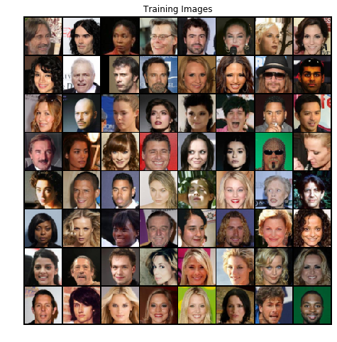
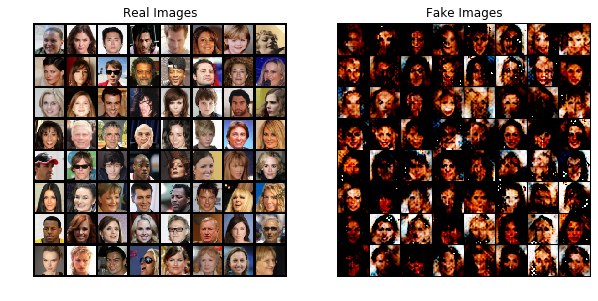

Self Attention GAN Tutorial
===========================

**Author** - `Avik Pal <https://avik-pal.github.io>`__

`Try this tutorial on
Colab <https://colab.research.google.com/drive/1BHRrau_awrfisc7z-q228hCRvt_TE3u->`__

In this tutorial we shall be implementing **Self Attention GAN**
(SAGAN), which makes use of the novel **Self Attention** layer as
proposed in `Self-Attention Generative Adversarial Networks by Zhang et.
al. <https://arxiv.org/abs/1805.08318>`__. **Self Attention**, is
incorporated in both the **Generator** as well as the **Discriminator**,
leading to *state-of-the-art* results on ImageNet

The tutorial helps you with the following:

1. Understanding how to use the **torchgan.layers API**.
2. Creating custom Generator and Discriminator architectures that fit in
   seamlessly with **TorchGAN’** by simply extending the base
   **torchgan.models.Generator** and **torchgan.models.Discriminator**
   classes
3. Visualizing the samples generated on the **CelebA Dataset**. We stick
   to such a simple dataset for illustration purposes and convergence
   time issues

This tutorial assumes that your system has **Pytorch** and **torchgan**
installed properly. If not, head over to the installation instructions
on the `official documentation
website <https://torchgan.readthedocs.io/en/latest/>`__.

.. code:: ipython3

    # General Imports
    import os
    import random
    import matplotlib.pyplot as plt
    import numpy as np
    # Pytorch and Torchvision Imports
    import torch
    import torchvision
    from torch.optim import Adam
    import torch.nn as nn
    import torch.utils.data as data
    import torchvision.datasets as dsets
    import torchvision.transforms as transforms
    import torchvision.utils as vutils
    # Torchgan Imports
    import torchgan
    from torchgan.layers import SpectralNorm2d, SelfAttention2d
    from torchgan.models import Generator, Discriminator
    from torchgan.losses import WassersteinGeneratorLoss, WassersteinDiscriminatorLoss, WassersteinGradientPenalty
    from torchgan.trainer import Trainer

.. code:: ipython3

    # Set random seed for reproducibility
    manualSeed = 144
    random.seed(manualSeed)
    torch.manual_seed(manualSeed)
    print("Random Seed: ", manualSeed)

.. parsed-literal::

    Random Seed:  144

Load the Dataset
----------------

Before starting this tutorial, download the `CelebA
dataset <http://mmlab.ie.cuhk.edu.hk/projects/CelebA.html>`__. Extract
the file named **img_align_celeba.zip**. The directory structure should
be:

::

   --> path/to/data
       --> img_align_celeba
           --> 188242.jpg
           --> 173822.jpg
           --> 284702.jpg
           --> 537394.jpg
              ...

We make the following transforms before feeding the **CelebA Dataset**
into the networks

1. By convention, the default input size in **torchgan.models** is a
   power of 2 and at least 16. Hence we shall be resizing the images to
   :math:`3 \times 64 \times 64`.

2. First, we will make a **center crop** of :math:`160 \times 160` of
   the images. Next we resize the images to
   :math:`3 \times 64 \times 64`. Direct resizing, affects the quality
   of the image. We want to generate faces, hence we want a major
   portion of the images to be filled by the faces.

3. The output quality of GANs is improved when the images are normalized
   with a mean and standard deviation of **0.5**, thereby constraining
   pixel values of the input in the range :math:`(-1, 1)`.

Finally the **torchgan.trainer.Trainer** needs a **DataLoader** as
input. So we are going to construct a DataLoader for the MNIST Dataset.

.. code:: ipython3

    dataset = dsets.ImageFolder("./CelebA",
                                transform=transforms.Compose([transforms.CenterCrop(160),
                                                              transforms.Resize((64, 64)),
                                                              transforms.ToTensor(),
                                                              transforms.Normalize((0.5, 0.5, 0.5), (0.5, 0.5, 0.5))]))

.. code:: ipython3

    dataloader = data.DataLoader(dataset, batch_size=64, shuffle=True, num_workers=8)

Generator Model
---------------

The SAGANGenerator receives an input noise vector of size
:math:`batch\ size \times encoding\ dims`. The output must be a torch
Tensor of size :math:`batch\ size \times 3 \times 64 \times 64`
conforming to the input MNIST size. We transform the noise to the image
in the following way:

1. **Channel Dimension**:
   :math:`encoding\ dims \rightarrow d \rightarrow \frac{d}{2} \rightarrow \frac{d}{4} \rightarrow \frac{d}{8} \rightarrow 1`.
2. **Image size**:
   :math:`(1 \times 1) \rightarrow (4 \times 4) \rightarrow (8 \times 8) \rightarrow (16 \times 16) \rightarrow (32 \times 32) \rightarrow (64 \times 64)`.

We are going to use **LeakyReLU** as the activation. Using ReLU will
kill most of the gradients and hence convergence is critically slowed
down. Hence it is a valid choice for the activation. At the end of the
model we use a **Tanh** activation. This ensures that the pixel values
range from :math:`(-1\ to\ 1)`.

--------------

**SelfAttention2d** is present out-of-box in torchgan. Self Attention
simply learns an attention map to learn ot attend to certain places of
the image. It contains 3 convolutional layers, named **query**, **key**
and **value**. The weights of these layers are learned. We compute the
attention map by:

.. math:: attention = softmax((query(x)^T \times key(x)))

.. math:: output = \gamma \times value(x) \times attention + x

:math:`\gamma` is simply a scaling parameter which is also learning. Its
value is initially set to 0. As result in the beginning, the Self
Attention Layer does nothing. As the network starts learning the
features the value of :math:`\gamma` increases and so does the effect of
the attention map. This is done to ensure that the model initially
focusses on learning the local features (which are relatively easy to
learn). Once it has learnt to detect the local features it focusses on
learning the more global features.

For more information on SelfAttention2d, use ``help(SelfAttention2d)``.

--------------

The Generator model needs 2 inputs, the :math:`1^{st}` one is the
**encoding_dims** and the :math:`2^{nd}` one is the **label_type**.
Since SAGAN is not a conditional model, we are going to set the
**label_type** as **‘none’**. For conditioned models there are 2 options
- **‘generated’** and **‘required’**. We shall discuss them in detail in
later tutorials.

The training of SAGAN is same as the standard GANs, it is only an
architectural improvement. Hence subclassing the Generator, allows us to
use the default **train_ops**. We shall be discussing on how to write a
custom **train_ops** in a future tutorial.

.. code:: ipython3

    class SAGANGenerator(Generator):
        def __init__(self, encoding_dims=100, step_channels=64):
            super(SAGANGenerator, self).__init__(encoding_dims, 'none')
            d = int(step_channels * 8)
            self.model = nn.Sequential(
                SpectralNorm2d(nn.ConvTranspose2d(self.encoding_dims, d, 4, 1, 0, bias=True)),
                nn.BatchNorm2d(d), nn.LeakyReLU(0.2),
                SpectralNorm2d(nn.ConvTranspose2d(d, d // 2, 4, 2, 1, bias=True)),
                nn.BatchNorm2d(d // 2), nn.LeakyReLU(0.2),
                SpectralNorm2d(nn.ConvTranspose2d(d // 2, d // 4, 4, 2, 1, bias=True)),
                nn.BatchNorm2d(d // 4), nn.LeakyReLU(0.2),
                SelfAttention2d(d // 4),
                SpectralNorm2d(nn.ConvTranspose2d(d // 4, d // 8, 4, 2, 1, bias=True)),
                nn.BatchNorm2d(d // 8),
                SelfAttention2d(d // 8),
                SpectralNorm2d(nn.ConvTranspose2d(d // 8, 3, 4, 2, 1, bias=True)), nn.Tanh())

        def forward(self, x):
            x = x.view(-1, x.size(1), 1, 1)
            return self.model(x)

Discriminator Model
-------------------

The SAGANDiscriminator receives an image in the form of a torch Tensor
of size :math:`batch\ size \times 3 \times 64 \times 64`. It must output
a tensor of size :math:`batch\ size`, where each value corresponds to
the confidence of whether or not that is image is real. Since we use a
**Tanh** activation at the end of the model, the outputs **cannot be
interpreted as probabilities**. Instead we interpret them as follows:

1. A **Higher** value (*closer to 1.0*) indicates that the discriminator
   believes the image to be a real one.
2. A **Lower** value (*closer to -1.0*) indicates that the discriminator
   believes the image to be a fake one.

--------------

For reasons same as above we use a **LeakyReLU** activation. The
conversion of the image tensor to the confidence scores are as follows:

1. **Channel Dimension**:
   :math:`1 \rightarrow d \rightarrow 2 \times d \rightarrow 4 \times d \rightarrow 8 \times d \rightarrow 1`.
2. **Image size**:
   :math:`(64 \times 64) \rightarrow (32 \times 32) \rightarrow (16 \times 16) \rightarrow (8 \times 8) \rightarrow (4 \times 4) \rightarrow (1 \times 1)`.

--------------

The Discriminator also needs 2 inputs. The :math:`1^{st}` one is the
channel dimension of the input image. In our case, we have grayscale
images so this value is *1*. The :math:`2^{nd}` argument is the
**label_type**, which is again **‘none’**

.. code:: ipython3

    class SAGANDiscriminator(Discriminator):
        def __init__(self, step_channels=64):
            super(SAGANDiscriminator, self).__init__(3, 'none')
            d = step_channels
            self.model = nn.Sequential(
                SpectralNorm2d(nn.Conv2d(self.input_dims, d, 4, 2, 1, bias=True)),
                nn.BatchNorm2d(d), nn.LeakyReLU(0.2),
                SpectralNorm2d(nn.Conv2d(d, d * 2, 4, 2, 1, bias=True)),
                nn.BatchNorm2d(d * 2), nn.LeakyReLU(0.2),
                SpectralNorm2d(nn.Conv2d(d * 2, d * 4, 4, 2, 1, bias=True)),
                nn.BatchNorm2d(d * 4), nn.LeakyReLU(0.2),
                SelfAttention2d(d * 4),
                SpectralNorm2d(nn.Conv2d(d * 4, d * 8, 4, 2, 1, bias=True)),
                nn.BatchNorm2d(d * 8),
                SelfAttention2d(d * 8),
                SpectralNorm2d(nn.Conv2d(d * 8, 1, 4, 1, 0, bias=True)), nn.Tanh())

        def forward(self, x):
            return self.model(x)

Model Parameters & Hyperparameters
----------------------------------

In this section we are going to define how the model is going to look
like, what their optimizers are going to be and every other possible
hyperparameter. We use a dictionary to feed the input into the trainer.
We believe it to be a much cleaner approach than individual arguments
which tend to limit the capacity of the Trainer.

--------------

We follow a standard naming system for parsing arguments. **name**
refers to the **class** whose object is to be created. **args** contains
the arguments that will be fed into the **class** while instantiating
it. The keys refer to the **variable names** with which the **object**
shall be stored in the **Trainer**. This storage pattern allows us to
have customs **train_ops** for Losses with no furthur headaches, but
thats again for a future discussion. The items in the dictionary are
allowed to have the following keys:

1. “name”: The class name for the model.
2. “args”: Arguments fed into the class.
3. “optimizer”: A dictionary containing the following key-value pairs

   -  “name”
   -  “args”
   -  “var”: Variable name for the optimizer. This is an optional
      argument. If this is not provided, we assign the optimizer the
      name **optimizer_{}** where {} refers to the variable name of the
      model.
   -  “scheduler”: Optional scheduler associated with the optimizer.
      Again this is a dictionary with the following keys

      -  “name”
      -  “args”

--------------

Lets see the interpretation of the ``network_params`` defined in the
following code block. This dictionary gets interpreted as follows in the
Trainer:

.. code:: python

   generator = SAGANGenerator(step_channels = 32)
   optimizer_generator = Adam(generator.parameters(), lr = 0.0001, betas = (0.0, 0.999))

   discriminator = SAGANDiscriminator(step_channels = 32)
   optimizer_discriminator = Adam(discriminator.parameters(), lr = 0.0004, betas = (0.0, 0.999))

As observed we are using the **TTUR (Two Timescale Update Rule)** for
training the models. Hence we can easily customize most of the training
pipeline even with such high levels of abstraction.

.. code:: ipython3

    network_params = {
        "generator": {"name": SAGANGenerator, "args": {"step_channels": 32},
                      "optimizer": {"name": Adam, "args": {"lr": 0.0001, "betas": (0.0, 0.999)}}},
        "discriminator": {"name": SAGANDiscriminator, "args": {"step_channels": 32},
                          "optimizer": {"name": Adam, "args": {"lr": 0.0004, "betas": (0.0, 0.999)}}}
    }

.. code:: ipython3

    if torch.cuda.is_available():
        device = torch.device("cuda:0")
        # Use deterministic cudnn algorithms
        torch.backends.cudnn.deterministic = True
        epochs = 20
    else:
        device = torch.device("cpu")
        epochs = 10

    print("Device: {}".format(device))
    print("Epochs: {}".format(epochs))

.. parsed-literal::

    Device: cuda:0
    Epochs: 20

We need to feed a list of losses to the trainer. These losses control
the optimization of the model weights. We are going to use the following
losses, all of which are defined in the **torchgan.losses** module.

1. WassersteinGeneratorLoss
2. WassersteinDiscriminatorLoss

We need the **clip** parameter to enforce the **Lipschitz condition**.

.. code:: ipython3

    losses_list = [WassersteinGeneratorLoss(), WassersteinDiscriminatorLoss(clip=(-0.01, 0.01))]

Visualize the Training Data
---------------------------

.. code:: ipython3

    # Plot some of the training images
    real_batch = next(iter(dataloader))
    plt.figure(figsize=(8,8))
    plt.axis("off")
    plt.title("Training Images")
    plt.imshow(np.transpose(vutils.make_grid(real_batch[0].to(device)[:64], padding=2, normalize=True).cpu(),(1,2,0)))
    plt.show()

Training the Generator & Discriminator
--------------------------------------

Next we simply feed the network descriptors and the losses we defined
previously into the Trainer. Then we pass the **CelebA DataLoader** to
the trainer object and wait for training to complete.

--------------

Important information for visualizing the performance of the GAN will be
printed to the console. The best and recommended way to visualize the
training is to use **tensorboardX**. It plots all the data and
periodically displays the generated images. It allows us to track
failure of the model early.

.. code:: ipython3

    trainer = Trainer(network_params, losses_list, sample_size=64, epochs=epochs, device=device)

.. code:: ipython3

    trainer(dataloader)

.. parsed-literal::

    Saving Model at './model/gan0.model'
    Epoch 1 Summary
    generator Mean Gradients : 1.77113134345256
    discriminator Mean Gradients : 168.43573220352587
    Mean Running Discriminator Loss : -0.22537715325384405
    Mean Running Generator Loss : 0.14026778625453137
    Generating and Saving Images to ./images/epoch1_generator.png

    Saving Model at './model/gan1.model'
    Epoch 2 Summary
    generator Mean Gradients : 0.9709061059735268
    discriminator Mean Gradients : 157.5974371968578
    Mean Running Discriminator Loss : -0.16900254713096868
    Mean Running Generator Loss : 0.14780808075226576
    Generating and Saving Images to ./images/epoch2_generator.png

    Saving Model at './model/gan2.model'
    Epoch 3 Summary
    generator Mean Gradients : 0.6489546410498336
    discriminator Mean Gradients : 114.98364009010012
    Mean Running Discriminator Loss : -0.11867836168094256
    Mean Running Generator Loss : 0.19490897187906048
    Generating and Saving Images to ./images/epoch3_generator.png

    Saving Model at './model/gan3.model'
    Epoch 4 Summary
    generator Mean Gradients : 0.4868257320647477
    discriminator Mean Gradients : 86.2763495400698
    Mean Running Discriminator Loss : -0.08904993991659228
    Mean Running Generator Loss : 0.1904535200702192
    Generating and Saving Images to ./images/epoch4_generator.png

    Saving Model at './model/gan4.model'
    Epoch 5 Summary
    generator Mean Gradients : 0.38948207173275806
    discriminator Mean Gradients : 69.02853520311747
    Mean Running Discriminator Loss : -0.07132210757201371
    Mean Running Generator Loss : 0.1905164212885189
    Generating and Saving Images to ./images/epoch5_generator.png

    Saving Model at './model/gan0.model'
    Epoch 6 Summary
    generator Mean Gradients : 0.3246079975508068
    discriminator Mean Gradients : 57.5312176712745
    Mean Running Discriminator Loss : -0.05952403193409332
    Mean Running Generator Loss : 0.17362464690314444
    Generating and Saving Images to ./images/epoch6_generator.png

    Saving Model at './model/gan1.model'
    Epoch 7 Summary
    generator Mean Gradients : 0.27834129726176327
    discriminator Mean Gradients : 49.32014204125727
    Mean Running Discriminator Loss : -0.05110680903443571
    Mean Running Generator Loss : 0.15047294811308712
    Generating and Saving Images to ./images/epoch7_generator.png

    Saving Model at './model/gan2.model'
    Epoch 8 Summary
    generator Mean Gradients : 0.2436902298260644
    discriminator Mean Gradients : 43.17338008539887
    Mean Running Discriminator Loss : -0.044874970704749856
    Mean Running Generator Loss : 0.14005806132055232
    Generating and Saving Images to ./images/epoch8_generator.png

    Saving Model at './model/gan3.model'
    Epoch 9 Summary
    generator Mean Gradients : 0.21672769602033234
    discriminator Mean Gradients : 38.38748390466974
    Mean Running Discriminator Loss : -0.039981993353946546
    Mean Running Generator Loss : 0.13571158462696095
    Generating and Saving Images to ./images/epoch9_generator.png

    Saving Model at './model/gan4.model'
    Epoch 10 Summary
    generator Mean Gradients : 0.1952347071559998
    discriminator Mean Gradients : 34.56422227626667
    Mean Running Discriminator Loss : -0.03613073442230222
    Mean Running Generator Loss : 0.12864465605549874
    Generating and Saving Images to ./images/epoch10_generator.png

    Saving Model at './model/gan0.model'
    Epoch 11 Summary
    generator Mean Gradients : 0.1775981319981621
    discriminator Mean Gradients : 31.454199781219547
    Mean Running Discriminator Loss : -0.03307153787981248
    Mean Running Generator Loss : 0.13509893063628797
    Generating and Saving Images to ./images/epoch11_generator.png

    Saving Model at './model/gan1.model'
    Epoch 12 Summary
    generator Mean Gradients : 0.16295655864904277
    discriminator Mean Gradients : 28.875490267485677
    Mean Running Discriminator Loss : -0.030632276347845874
    Mean Running Generator Loss : 0.14017400717159842
    Generating and Saving Images to ./images/epoch12_generator.png

    Saving Model at './model/gan2.model'
    Epoch 13 Summary
    generator Mean Gradients : 0.15057951283307058
    discriminator Mean Gradients : 26.681105836543757
    Mean Running Discriminator Loss : -0.028432457974863937
    Mean Running Generator Loss : 0.13980871607851636
    Generating and Saving Images to ./images/epoch13_generator.png

    Saving Model at './model/gan3.model'
    Epoch 14 Summary
    generator Mean Gradients : 0.1400135161742742
    discriminator Mean Gradients : 24.800612972944485
    Mean Running Discriminator Loss : -0.0265985547110469
    Mean Running Generator Loss : 0.13859486044934127
    Generating and Saving Images to ./images/epoch14_generator.png

    Saving Model at './model/gan4.model'
    Epoch 15 Summary
    generator Mean Gradients : 0.1307287814462747
    discriminator Mean Gradients : 23.165709149010674
    Mean Running Discriminator Loss : -0.02494551981316288
    Mean Running Generator Loss : 0.14510318926085672
    Generating and Saving Images to ./images/epoch15_generator.png

    Saving Model at './model/gan0.model'
    Epoch 16 Summary
    generator Mean Gradients : 0.1227011924800533
    discriminator Mean Gradients : 21.726917840977894
    Mean Running Discriminator Loss : -0.023448043124474856
    Mean Running Generator Loss : 0.14266379811199903
    Generating and Saving Images to ./images/epoch16_generator.png

    Saving Model at './model/gan1.model'
    Epoch 17 Summary
    generator Mean Gradients : 0.11559937904745647
    discriminator Mean Gradients : 20.461799139297252
    Mean Running Discriminator Loss : -0.02220305513353133
    Mean Running Generator Loss : 0.14137916305880027
    Generating and Saving Images to ./images/epoch17_generator.png

    Saving Model at './model/gan2.model'
    Epoch 18 Summary
    generator Mean Gradients : 0.10929708473319634
    discriminator Mean Gradients : 19.349743163579785
    Mean Running Discriminator Loss : -0.02115189434317846
    Mean Running Generator Loss : 0.13864294942233577
    Generating and Saving Images to ./images/epoch18_generator.png

    Saving Model at './model/gan3.model'
    Epoch 19 Summary
    generator Mean Gradients : 0.10359450726044966
    discriminator Mean Gradients : 18.344899341288944
    Mean Running Discriminator Loss : -0.02013682700529223
    Mean Running Generator Loss : 0.13920225016189366
    Generating and Saving Images to ./images/epoch19_generator.png

    Saving Model at './model/gan4.model'
    Epoch 20 Summary
    generator Mean Gradients : 0.0984515709914916
    discriminator Mean Gradients : 17.433214980945856
    Mean Running Discriminator Loss : -0.01917175263544031
    Mean Running Generator Loss : 0.13852676915744744
    Generating and Saving Images to ./images/epoch20_generator.png

    Training of the Model is Complete

.. code:: ipython3

    trainer.complete()

.. parsed-literal::

    Saving Model at './model/gan0.model'

Visualize the Generated Data
----------------------------

.. code:: ipython3

    # Grab a batch of real images from the dataloader
    real_batch = next(iter(dataloader))

    # Plot the real images
    plt.figure(figsize=(10,10))
    plt.subplot(1,2,1)
    plt.axis("off")
    plt.title("Real Images")
    plt.imshow(np.transpose(vutils.make_grid(real_batch[0].to(device)[:64], padding=5, normalize=True).cpu(),(1,2,0)))

    # Plot the fake images from the last epoch
    plt.subplot(1,2,2)
    plt.axis("off")
    plt.title("Fake Images")
    plt.imshow(plt.imread("{}/epoch{}_generator.png".format(trainer.recon, trainer.epochs)))
    plt.show()

