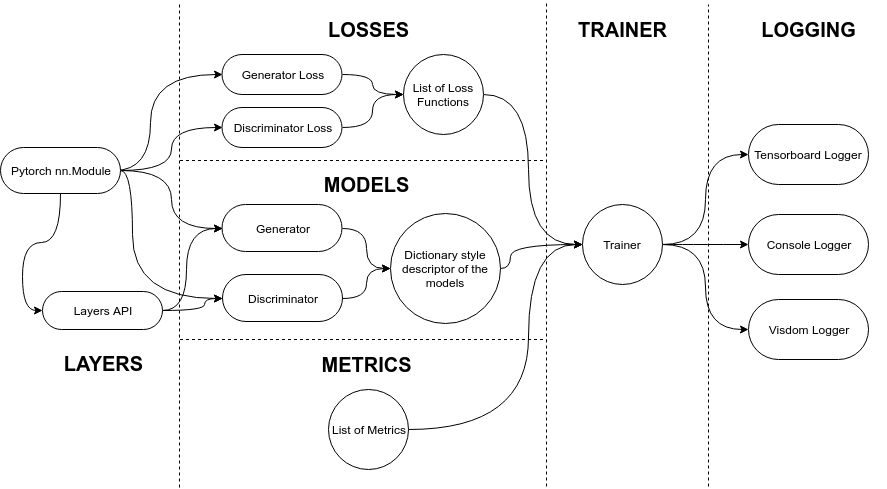

# Abstract

TorchGAN is a PyTorch based framework for writing succinct and comprehensible code for training and evaluation of Generative Adversarial Networks. The framework's modular design allows effortless customization of the model architecture, loss functions, training paradigms, and evaluation metrics. The key features of TorchGAN are its extensibility, built-in support for a large number of popular models, losses and evaluation metrics, and zero overhead compared to vanilla PyTorch. By using the framework to implement several popular GAN models, we demonstrate its extensibility and ease of use. We also benchmark the training time of our framework for said models against the corresponding baseline PyTorch implementations and observe that TorchGAN's features bear almost zero overhead.

# Introduction

Generative Adversarial Networks (GANs) [@gan2014] are a class of deep generative models that formulate the model estimation problem as an adversarial game between two neural networks, a Generator representing an implicit generative distribution, and a Discriminator that differentiates between samples from said implicit distribution and the true data distribution. The implicit distribution recovers the data distribution when the game reaches equilibrium. Apart from being one of the most popular approaches for generative modeling and unsupervised learning tasks in Computer Vision, with diverse applications such as photo-realistic image generation [@biggan; @karras2017progressive], image super-resolution [@srgan], image-to-image translation [@cyclegan] and video generation [@dvdgan; @mocogan], it has also found applicability in domains such as Natural Language Processing [@zhang2017adversarial] and Time Series Analysis [@esteban2017real].

GANs generally share a standard design paradigm, with the building blocks comprising one or more generator and discriminator models, and the associated loss functions for training them. TorchGAN makes use of this design similarity by exposing a simple API for customizing these blocks. The interaction between these components at training time is facilitated by a highly robust trainer which automatically adapts to user-defined GAN models and losses. TorchGAN provides an extensive and continually expanding collection of popular GAN models, losses, evaluation metrics, and stability-enhancing features, which can either be used off the shelf or easily extended or combined to design more sophisticated models effortlessly. With the above design principles in mind, we aim to improve upon existing GAN training frameworks such as TFGAN [@tfgan], HyperGAN [@hypergan], and IBM GAN-Toolkit [@gantoolkit] on the aspects of extensibility, the richness of the feature set and documentation.

# Implementing Models in TorchGAN

The core of the TorchGAN framework is a highly versatile trainer module, responsible for its flexibility and ease of use. The trainer requires specification of the generator and the discriminator architecture along with the optimizers associated with each of them, represented as a dictionary, as well as the list of associated loss functions, and optionally, evaluation metrics.  We provide an illustrative example for training DCGAN on CIFAR10. One can either choose from the in-built implementations of popular GAN models, losses and metrics or define custom variants of their own with minimal effort by extending the appropriate base classes. This extensibility is widely useful in research applications where the user only needs to write code for the model architecture and/or the loss function. The trainer automatically handles the intricacies of training with custom models/losses. The trainer also supports the usage of multiple generators and discriminators, allowing training of more sophisticated models such as Generative Multi Adversarial Networks [@gman]. Performance visualization is handled by a customizable Logger object, which, apart from console logging, currently supports the Tensorboard and Vizdom backends.

```python
train_dataset = dsets.CIFAR10(
    root='./cifar10',
    train=True,
    transform=transforms.Compose(
        [transforms.ToTensor(),
        transforms.Normalize(mean=(0.5, 0.5, 0.5), std=(0.5, 0.5, 0.5))]
    ),
    download=True
)
train_loader = data.DataLoader(train_dataset, batch_size=128, shuffle=True)

trainer = Trainer({
    "generator": {
        "name": DCGANGenerator,
        "args": {"out_channels": 3, "step_channels": 16},
        "optimizer": {
            "name": Adam,
            "args": {"lr": 0.0002, "betas": (0.5, 0.999)}
        }
    }, 
    "discriminator": {
        "name": DCGANDiscriminator,
        "args": {"in_channels": 3, "step_channels": 16},
        "optimizer": {
            "name": Adam,
            "args": {"lr": 0.0002, "betas": (0.5, 0.999)}
        }
    }},
    [MinimaxGeneratorLoss(), MinimaxDiscriminatorLoss()],
    sample_size=64,
    epochs=20
)

trainer(train_loader)
```



# Existing Frameworks

TorchGAN provides high-quality implementations of various GAN models, metrics for evaluating GANs, and various approaches for improving the stability of GAN training. We provide an overview of the features that are provided off the shelf by TorchGAN and compare them with the ones provided by other frameworks. Note that the list is not exhaustive as the modular and extensible structure of TorchGAN allows one to extend or modify these features, or use them as building blocks for more sophisticated models.


Table \ref{tab:frameworks} summarizes the features supported by a variety of open-source GAN frameworks. It suggests that TorchGAN supports the widest variety of features among the frameworks being considered. For comparison, we only consider the models present in the official repository of a given framework or an associated officially maintained model-zoo/examples repository. We avoid comparisons with projects like Pytorch-GAN\footnote{https://github.com/eriklindernoren/PyTorch-GAN}, Keras-GAN\footnote{https://github.com/eriklindernoren/Keras-GAN}, etc., as these are not frameworks and hence cannot be extended to newer models.

# Performance

In order to demonstrate that TorchGAN incurs zero training overhead despite the high level of abstraction it provides, we compare the training time of TorchGAN with vanilla PyTorch implementations of DCGAN [@dcgan2015], CGAN [@mirza2014conditional], BEGAN [@berthelot2017began] and WGAN-GP [@gulrajani2017improved]. Table \ref{tab:benchmarks} reports the training time for TorchGAN and Pytorch for 1 epoch, averaged over 8 runs.

\begin{center}
    \begin{tabular}{ c c c c c }
        & \textbf{DCGAN} & \textbf{CGAN} & \textbf{WGAN-GP} & \textbf{BEGAN} \\
        & \scriptsize{\textit{CIFAR-10}} & \scriptsize{\textit{MNIST}} & \scriptsize{\textit{MNIST}} & \scriptsize{\textit{MNIST}} \\
        \textbf{TorchGAN} & \textbf{15.9s $\pm$ 0.64s} & \textbf{21.8s $\pm$ 0.43s} & \textbf{30.6s $\pm$ 1.35s} & \textbf{86.0s $\pm$ 0.62s} \\
        \textbf{Pytorch}  & 16.7s $\pm$ 0.24s & 22.4s $\pm$ 0.52s & 31.1s $\pm$ 0.97s & 87.0s $\pm$ 0.27s \\
    \end{tabular}
    \captionof{table}{Average Training Time: TorchGAN vs Pytorch Baselines}
    \label{tab:benchmarks}
\end{center}


For a fair comparison, we disable any form of logging and compute the training time using the $\%timeit$ magic function. We train the models on the CIFAR10 [@Krizhevsky2009LearningML] and MNIST datasets, with a batch size of 128, on an Nvidia GTX Titan X GPU.

# Conclusion and Future Work

We present the features of the TorchGAN framework and demonstrate its extensibility, ease of use and efficiency.  Future work and extensions under active development include, integration of GAN models for video generation, generalization of the training loop to support Inference GAN models, such that they can be conveniently modified and extended, addition of features such as Adaptive Instance Normalization layers, and expanding the model zoo and documentation to cover more sophisticated examples such as Multi Agent-GAN training. We also envision the extension of the framework to domains beyond Computer Vision by adding support for NLP and Time Series GAN models.

# References
